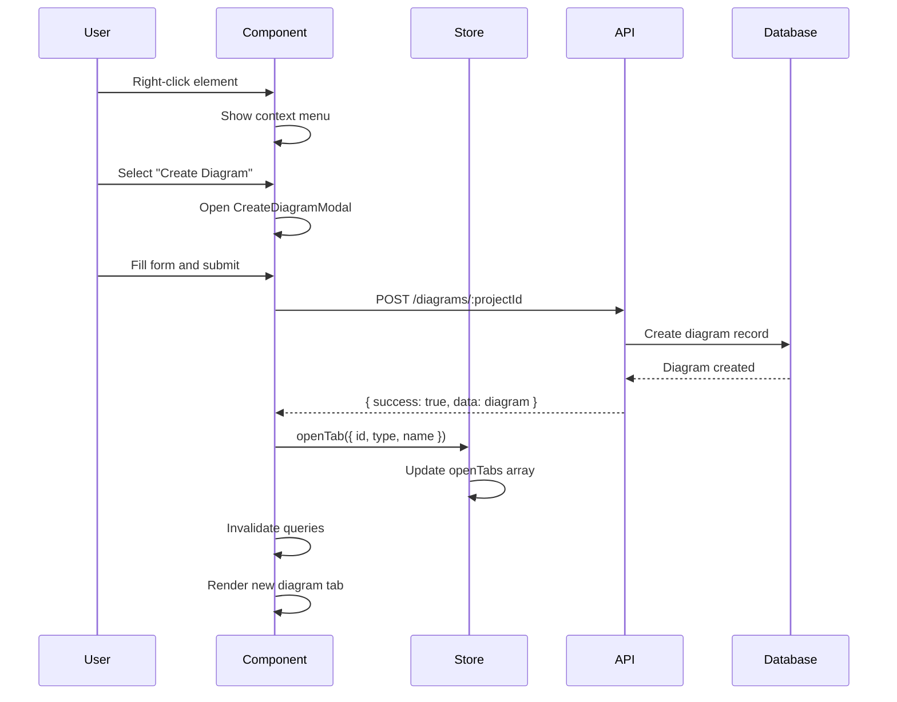
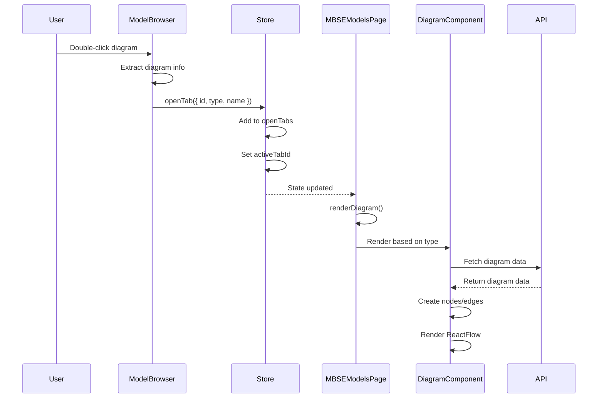
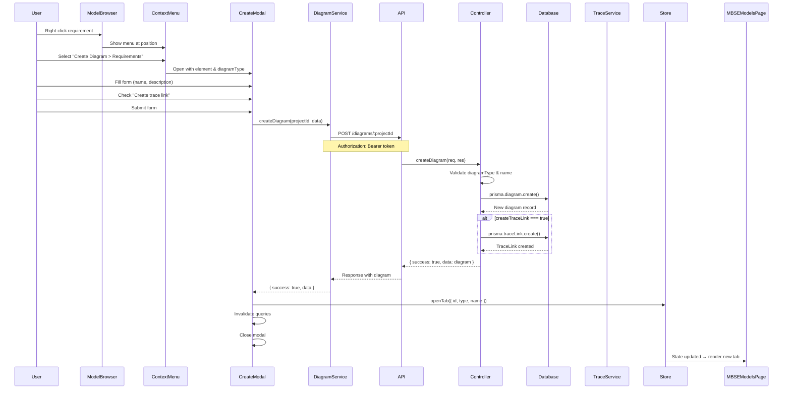
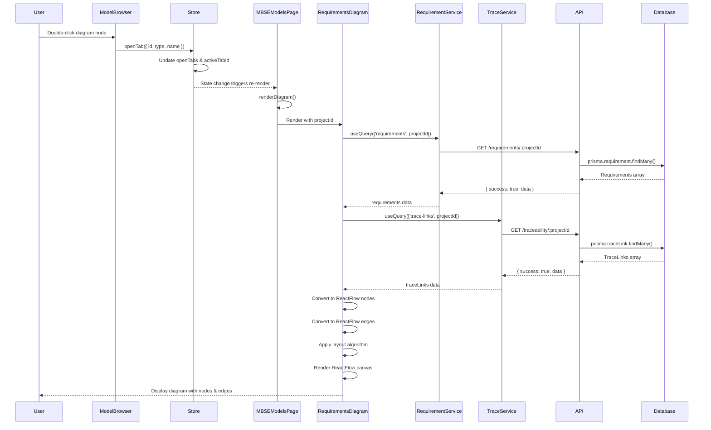
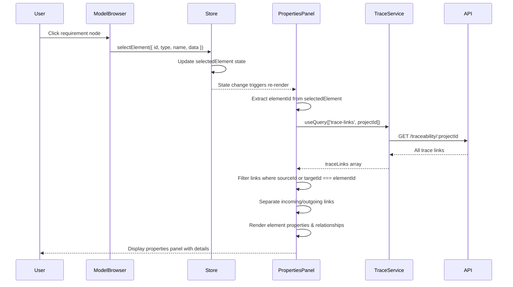
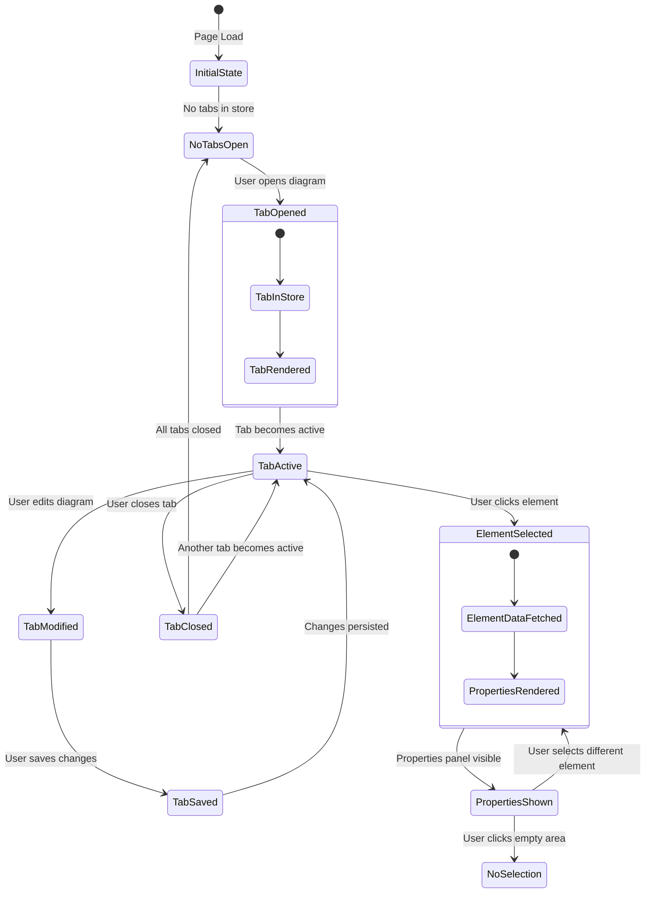

# MBSE Models - Complete Structure Documentation

## ⚠️ IMPORTANT MAINTENANCE NOTE

**This documentation file MUST be updated whenever any changes are made to the MBSE Models features, components, APIs, or data structures.**

When updating this file:
1. Update the relevant sections with the new changes
2. Update the "Last Updated" date at the bottom of this document
3. Delete any old versions of this file to avoid confusion
4. Ensure all code references and file paths are accurate
5. Update data flow diagrams if the architecture changes

**Failure to keep this document updated will result in outdated documentation that may mislead developers and agents.**

---

## Table of Contents

1. [Introduction and Overview](#1-introduction-and-overview)
2. [Architecture Overview](#2-architecture-overview)
3. [File Structure](#3-file-structure)
4. [Core Components Documentation](#4-core-components-documentation)
5. [State Management](#5-state-management)
6. [Backend API Documentation](#6-backend-api-documentation)
7. [Database Schema](#7-database-schema)
8. [Data Flow Diagrams](#8-data-flow-diagrams)
9. [Context Menu System](#9-context-menu-system)
10. [Integration Points](#10-integration-points)
11. [Type Definitions](#11-type-definitions)
12. [Diagram Type Details](#12-diagram-type-details)
13. [Tool Integration](#13-tool-integration)
14. [Maintenance and Updates](#14-maintenance-and-updates)

---

## 1. Introduction and Overview

### 1.1 Purpose and Scope

The MBSE Models page provides a comprehensive Model-Based Systems Engineering (MBSE) modeling environment that follows industry-standard patterns used in tools like Cameo Systems Modeler, IBM Rhapsody, and Enterprise Architect.

**Primary Goals:**
- Provide a unified interface for creating, viewing, and managing SysML/UML diagrams
- Enable hierarchical navigation of model elements (requirements, functions, use cases, parameters)
- Support multiple diagram types simultaneously through a tabbed workspace
- Maintain bidirectional synchronization with dedicated feature pages
- Support traceability between model elements and diagrams

**Key Features:**
- Three-panel layout (Model Browser, Diagram Workspace, Properties Panel)
- Tabbed diagram management
- Context menu for creating diagrams from model elements
- Visual grouping and type-based organization
- Real-time verification coverage monitoring
- Integration with analysis and validation tools

### 1.2 Industry-Standard Alignment

The implementation follows established patterns from commercial MBSE tools:

- **Cameo Systems Modeler**: Three-panel layout with Model Browser, Diagram Canvas, and Properties Panel
- **IBM Rhapsody**: Tabbed workspace for multiple diagrams
- **Enterprise Architect**: Hierarchical model navigation with context menus
- **SysML/UML Standards**: Compliance with OMG SysML 1.6 and UML 2.5 specifications

### 1.3 Key Capabilities

1. **Diagram Management**: Create, open, close, and manage multiple diagrams simultaneously
2. **Model Navigation**: Hierarchical tree view of all model elements organized by type
3. **Element Selection**: Click to select elements and view properties
4. **Diagram Creation**: Right-click context menu to create diagrams from elements
5. **Traceability**: Automatic trace link creation when diagrams are linked to elements
6. **Visual Grouping**: Requirements grouped by type with color coding
7. **Verification Integration**: Embedded verification coverage dashboard
8. **Export/Import**: Support for ReqIF, XMI, and image exports

---

## 2. Architecture Overview

### 2.1 Three-Panel Layout

The MBSE Models page uses a three-panel layout that provides comprehensive model management:

```
┌─────────────┬──────────────────────────────┬──────────────┐
│             │                              │              │
│   Model     │     Diagram Workspace        │  Properties  │
│   Browser   │     (Tabbed View)            │    Panel     │
│             │                              │              │
│  - SysML    │  ┌────────────────────────┐ │  - Element   │
│    Diagrams │  │ [Diagram Tab 1] [Tab 2]│ │    Details   │
│  - Model    │  ├────────────────────────┤ │  - Attributes │
│    Elements │  │                        │ │  - Relations  │
│  - Verif.   │  │    ReactFlow Canvas    │ │  - Status     │
│  - Trace.   │  │                        │ │              │
│  - Analysis │  │   [Diagram Content]    │ │              │
│             │  │                        │ │              │
│             │  └────────────────────────┘ │              │
│             │                              │              │
└─────────────┴──────────────────────────────┴──────────────┘
```

**Panel Features:**
- **Model Browser (Left)**: Hierarchical navigation, resizable (200-400px), collapsible
- **Diagram Workspace (Center)**: Tabbed interface for multiple diagrams, ReactFlow canvas
- **Properties Panel (Right)**: Context-sensitive element details, resizable (250-450px), collapsible

### 2.2 Component Hierarchy

```mermaid
graph TD
    A[MBSEModelsPage] --> B[ModelBrowser]
    A --> C[DiagramTabs]
    A --> D[OrganizedToolbar]
    A --> E[PropertiesPanel]
    A --> F[Diagram Components]
    A --> G[Tool Modals]
    
    B --> H[VerificationPanel]
    B --> I[ContextMenu]
    B --> J[CreateDiagramModal]
    
    C --> K[SingleTab]
    C --> L[TabContextMenu]
    
    F --> M[RequirementsDiagram]
    F --> N[UseCaseDiagram]
    F --> O[BlockDefinitionDiagram]
    F --> P[InternalBlockDiagram]
    F --> Q[ParametricDiagram]
    F --> R[ParameterRequirementDiagram]
    F --> S[ActivityDiagram]
    F --> T[SequenceDiagram]
    F --> U[StateMachineDiagram]
    F --> V[PackageDiagram]
    
    M --> W[RequirementNode]
    N --> X[UseCaseNode]
    N --> Y[ActorNode]
    O --> Z[BlockNode]
    S --> AA[ActivityNode]
    U --> AB[StateNode]
    
    G --> AC[ModelValidationEngine]
    G --> AD[ImpactAnalysisView]
    G --> AE[VerificationCoverageDashboard]
    G --> AF[EnhancedTraceabilityMatrix]
    G --> AG[DiagramEditor]
    G --> AH[StandardExporter]
```



### 2.3 Technology Stack

**Frontend:**
- **React 18**: Component-based UI framework
- **TypeScript**: Type-safe JavaScript
- **ReactFlow**: Node-based diagram rendering
- **Zustand**: Lightweight state management with persistence
- **React Query (TanStack Query)**: Server state management and caching
- **React Router**: Client-side routing
- **Tailwind CSS**: Utility-first CSS framework
- **Lucide React**: Icon library

**Backend:**
- **Node.js**: JavaScript runtime
- **Express**: Web framework
- **TypeScript**: Type-safe backend code
- **Prisma**: ORM for database access
- **PostgreSQL**: Relational database
- **JWT**: Authentication tokens

**Shared:**
- **TypeScript Types**: Shared type definitions in `shared/types/`

---

## 3. File Structure

### 3.1 Frontend Structure

```
frontend/src/
├── pages/
│   └── MBSEModels/
│       └── MBSEModelsPage.tsx          # Main page component
│
├── components/
│   └── mbse/
│       ├── ModelBrowser.tsx            # Hierarchical tree navigation
│       ├── DiagramTabs.tsx             # Tabbed workspace management
│       ├── PropertiesPanel.tsx         # Element details panel
│       ├── OrganizedToolbar.tsx        # Grouped action toolbar
│       ├── ContextMenu.tsx             # Right-click context menu
│       ├── CreateDiagramModal.tsx      # Diagram creation form
│       ├── VerificationPanel.tsx       # Verification stats dashboard
│       ├── MBSEDiagramMenu.tsx         # Diagram type selection menu
│       │
│       ├── diagrams/                   # Diagram components
│       │   ├── RequirementsDiagram.tsx
│       │   ├── UseCaseDiagram.tsx
│       │   ├── BlockDefinitionDiagram.tsx
│       │   ├── InternalBlockDiagram.tsx
│       │   ├── ParametricDiagram.tsx
│       │   ├── ParameterRequirementDiagram.tsx
│       │   ├── ActivityDiagram.tsx
│       │   ├── SequenceDiagram.tsx
│       │   ├── StateMachineDiagram.tsx
│       │   ├── PackageDiagram.tsx
│       │   └── index.ts                # Exports all diagrams
│       │
│       ├── nodes/                      # ReactFlow node components
│       │   ├── RequirementNode.tsx
│       │   ├── UseCaseNode.tsx
│       │   ├── ActorNode.tsx
│       │   ├── BlockNode.tsx
│       │   ├── ActivityNode.tsx
│       │   ├── StateNode.tsx
│       │   └── index.ts
│       │
│       ├── shared/                     # Shared diagram utilities
│       │   ├── DiagramExporter.tsx
│       │   ├── DiagramLegend.tsx
│       │   ├── DiagramToolbar.tsx
│       │   └── index.ts
│       │
│       ├── analysis/                   # Analysis tools
│       │   ├── EnhancedTraceabilityMatrix.tsx
│       │   ├── ImpactAnalysisView.tsx
│       │   ├── VerificationCoverageDashboard.tsx
│       │   └── index.ts
│       │
│       ├── validation/                 # Validation tools
│       │   ├── ModelValidationEngine.tsx
│       │   └── index.ts
│       │
│       ├── editing/                    # Editing tools
│       │   ├── DiagramEditor.tsx
│       │   └── index.ts
│       │
│       └── export/                     # Export tools
│           ├── StandardExporter.tsx
│           └── index.ts
│
├── store/
│   └── mbseStore.ts                    # Zustand store for MBSE state
│
└── services/
    └── diagram.service.ts              # API service for diagrams
```

### 3.2 Backend Structure

```
backend/src/
├── controllers/
│   └── diagram.controller.ts          # Diagram CRUD operations
│
├── routes/
│   └── diagrams.routes.ts             # API route definitions
│
└── middleware/
    └── auth.middleware.ts             # Authentication middleware

backend/prisma/
└── schema.prisma                      # Database schema (Diagram model)
```

### 3.3 Shared Types

```
shared/types/
├── diagram.types.ts                   # Diagram type definitions
├── engineering.types.ts               # Requirement, Function types
├── usecase.types.ts                   # UseCase types
├── traceability.types.ts              # TraceLink types
└── api.types.ts                       # API response types
```

---

## 4. Core Components Documentation

### 4.1 Main Page Component

**File**: `frontend/src/pages/MBSEModels/MBSEModelsPage.tsx`

**Responsibilities:**
- Orchestrates the three-panel layout
- Manages diagram tab state via Zustand store
- Handles diagram rendering based on active tab
- Coordinates modal states for tools (validation, analysis, export)
- Manages panel resizing and visibility

**Key State:**
```typescript
// Panel visibility and widths
const panelVisibility = { modelBrowser: boolean, propertiesPanel: boolean }
const panelWidths = { modelBrowser: number, propertiesPanel: number }

// Modal states
const [showValidation, setShowValidation] = useState(false)
const [showImpactAnalysis, setShowImpactAnalysis] = useState(false)
const [showVerificationCoverage, setShowVerificationCoverage] = useState(false)
const [showTraceabilityMatrix, setShowTraceabilityMatrix] = useState(false)
const [showDiagramEditor, setShowDiagramEditor] = useState(false)
const [showExporter, setShowExporter] = useState(false)
```

**Integration Points:**
- Receives `projectId` from URL params
- Integrates with `mbseStore` for tab and panel state
- Renders diagram components based on active tab type
- Handles navigation back to project pages

**Diagram Rendering Logic:**
```typescript
const renderDiagram = () => {
  switch (activeTab.type) {
    case 'req': return <RequirementsDiagram projectId={projectId} />
    case 'uc': return <UseCaseDiagram projectId={projectId} />
    case 'bdd': return <BlockDefinitionDiagram projectId={projectId} />
    case 'ibd': return <InternalBlockDiagram projectId={projectId} />
    case 'par': return <ParametricDiagram projectId={projectId} />
    case 'par-req': return <ParameterRequirementDiagram projectId={projectId} />
    case 'act': return <ActivityDiagram projectId={projectId} />
    case 'seq': return <SequenceDiagram projectId={projectId} />
    case 'stm': return <StateMachineDiagram projectId={projectId} />
    case 'pkg': return <PackageDiagram projectId={projectId} />
  }
}
```

### 4.2 Model Browser Component

**File**: `frontend/src/components/mbse/ModelBrowser.tsx`

**Purpose:**
Provides hierarchical navigation of all model elements, diagrams, and tools organized into categories.

**Structure:**
```
Model Browser Tree
├── SysML Diagrams
│   ├── Requirements
│   │   └── [Individual Diagrams]
│   ├── Structure
│   │   ├── Block Definition Diagrams
│   │   ├── Internal Block Diagrams
│   │   └── Package Diagrams
│   ├── Behavior
│   │   ├── Use Case Diagrams
│   │   ├── Activity Diagrams
│   │   ├── Sequence Diagrams
│   │   └── State Machine Diagrams
│   └── Parametric
│       ├── Parametric Diagrams
│       └── Parameter-Requirement Diagrams
├── Model Elements
│   ├── Requirements
│   │   ├── Functional (with count badge)
│   │   ├── Performance (with count badge)
│   │   ├── Interface (with count badge)
│   │   ├── Safety (with count badge)
│   │   ├── Security (with count badge)
│   │   ├── Constraint (with count badge)
│   │   ├── Usability (with count badge)
│   │   └── Uncategorized
│   │       └── [Individual Requirements]
│   ├── Functions
│   │   └── [Individual Functions]
│   ├── Use Cases
│   │   └── [Individual Use Cases]
│   └── Parameters
│       └── [Individual Parameters]
├── Verification & Validation
│   ├── Coverage
│   ├── Matrix
│   └── Model Validation
├── Traceability
│   ├── Matrix
│   ├── Impact Analysis
│   └── Suspect Links
└── Analysis Tools
    └── Coverage Reports
```

**Key Features:**
- **Requirement Grouping**: Requirements are automatically grouped by `requirementType` with count badges
- **Context Menu**: Right-click on elements (requirement, function, useCase, parameter) shows menu to create diagrams
- **Double-Click**: Double-click on diagrams opens them in a new tab
- **Expansion State**: Tree expansion state is persisted in Zustand store
- **Search/Filter**: Search functionality filters tree nodes
- **Verification Panel**: Embedded mini-dashboard showing verification stats

**Data Fetching:**
```typescript
// Requirements grouped by type
const { data: requirements } = useQuery(['requirements', projectId], ...)
const groupedRequirements = buildRequirementTree(requirements)

// Functions, Use Cases, Parameters
const { data: functions } = useQuery(['functions', projectId], ...)
const { data: useCases } = useQuery(['usecases', projectId], ...)
const { data: parameters } = useQuery(['parameters', projectId], ...)

// Diagrams
const { data: diagrams } = useQuery(['diagrams', projectId], ...)
```

**Context Menu Integration:**
When a user right-clicks on an element, `buildElementContextMenuItems()` creates menu items:
- **Create Diagram** submenu with all 10 diagram types
- View Details
- Edit
- Create Trace Link
- Delete (danger action)

### 4.3 Diagram Components

Each diagram component follows a similar pattern:

1. **Data Fetching**: Uses React Query to fetch relevant data
2. **Node Creation**: Converts data into ReactFlow nodes
3. **Edge Creation**: Creates relationships between nodes
4. **Layout Algorithm**: Arranges nodes in 2D space
5. **ReactFlow Rendering**: Renders nodes and edges on canvas

#### 4.3.1 Requirements Diagram

**File**: `frontend/src/components/mbse/diagrams/RequirementsDiagram.tsx`

**Purpose:** Visualizes requirements and their relationships with color coding by type.

**Key Features:**
- **Type-Based Grouping**: Toggle to group requirements by type in swimlanes
- **Visual Color Coding**: Each requirement type has distinct colors
- **Trace Links**: Shows relationships between requirements
- **Filters**: Filter by type, status, priority
- **Hierarchy Display**: Shows parent-child relationships

**Data Sources:**
- Requirements: `requirementService.getRequirements(projectId)`
- Trace Links: `traceabilityService.getTraceLinks(projectId)`

**Layout Algorithm:**
- **Default**: Grid layout with automatic spacing
- **Grouped by Type**: Arranges nodes in vertical swimlanes, one per type

**Node Type:** `RequirementNode` - Custom ReactFlow node component

#### 4.3.2 Use Case Diagram

**File**: `frontend/src/components/mbse/diagrams/UseCaseDiagram.tsx`

**Purpose:** Displays use cases and actors with relationships.

**Key Features:**
- Actor nodes (stick figures)
- Use case nodes (ellipses)
- Associations between actors and use cases
- Extends/Includes relationships

**Data Sources:**
- Use Cases: `useCaseService.getUseCases(projectId)`
- Actors: Fetched via use cases (actors array)

**Node Types:** `UseCaseNode`, `ActorNode`

#### 4.3.3 Block Definition Diagram (BDD)

**File**: `frontend/src/components/mbse/diagrams/BlockDefinitionDiagram.tsx`

**Purpose:** Defines system blocks and their relationships.

**Key Features:**
- Block nodes (rectangles)
- Composition/aggregation relationships
- Generalization/specialization
- Ports and interfaces

**Node Type:** `BlockNode`

#### 4.3.4 Internal Block Diagram (IBD)

**File**: `frontend/src/components/mbse/diagrams/InternalBlockDiagram.tsx`

**Purpose:** Shows internal structure of blocks with ports and flows.

**Key Features:**
- Internal blocks (parts)
- Ports (provided/required interfaces)
- Item flows (data/energy/mass flows)
- Connectors between ports

**Node Type:** `BlockNode` (specialized for IBD)

#### 4.3.5 Parametric Diagram

**File**: `frontend/src/components/mbse/diagrams/ParametricDiagram.tsx`

**Purpose:** Shows constraint parameters and equations.

**Key Features:**
- Constraint blocks
- Parameter nodes
- Constraint relationships
- Mathematical equations

**Data Sources:**
- Parameters: `parameterService.getParameters(projectId)`

#### 4.3.6 Parameter-Requirement Diagram

**File**: `frontend/src/components/mbse/diagrams/ParameterRequirementDiagram.tsx`

**Purpose:** Visualizes relationships between parameters and requirements.

**Key Features:**
- Parameter nodes (rectangles)
- Requirement nodes (with type colors)
- Derivation relationships (parameter derived from requirement)
- Constraint relationships
- Filtering by requirement type and parameter data type
- Grouping by type option

**Data Sources:**
- Parameters: `parameterService.getParameters(projectId)`
- Requirements: `requirementService.getRequirements(projectId)`
- Trace Links: `traceabilityService.getTraceLinks(projectId)`

#### 4.3.7 Activity Diagram

**File**: `frontend/src/components/mbse/diagrams/ActivityDiagram.tsx`

**Purpose:** Models workflows and business processes.

**Key Features:**
- Activity nodes
- Decision nodes (diamonds)
- Fork/Join nodes
- Control flow edges
- Object flow edges

**Node Type:** `ActivityNode`

#### 4.3.8 Sequence Diagram

**File**: `frontend/src/components/mbse/diagrams/SequenceDiagram.tsx`

**Purpose:** Shows interactions between objects over time.

**Key Features:**
- Lifelines (vertical lines)
- Activation boxes
- Messages (arrows with labels)
- Sequence numbers
- Loops and conditions

#### 4.3.9 State Machine Diagram

**File**: `frontend/src/components/mbse/diagrams/StateMachineDiagram.tsx`

**Purpose:** Models state transitions and behavior.

**Key Features:**
- State nodes (rounded rectangles)
- Initial/final states (circles)
- Transitions (arrows with triggers)
- Guards and actions

**Node Type:** `StateNode`

#### 4.3.10 Package Diagram

**File**: `frontend/src/components/mbse/diagrams/PackageDiagram.tsx`

**Purpose:** Organizes model elements into packages.

**Key Features:**
- Package nodes (folders)
- Package dependencies
- Namespace organization

### 4.4 Supporting Components

#### 4.4.1 DiagramTabs

**File**: `frontend/src/components/mbse/DiagramTabs.tsx`

**Purpose:** Manages multiple open diagram tabs.

**Features:**
- Tab list with icons and names
- Pin/unpin tabs (pinned tabs cannot be closed)
- Modified indicator (blue dot)
- Close button (only on hover for non-pinned)
- Right-click context menu (pin, close, close others, close all)
- Active tab highlighting

**State Management:**
- Uses `mbseStore` for `openTabs` and `activeTabId`
- Actions: `setActiveTab`, `closeTab`, `pinTab`, `unpinTab`

#### 4.4.2 PropertiesPanel

**File**: `frontend/src/components/mbse/PropertiesPanel.tsx`

**Purpose:** Displays context-sensitive details of selected elements.

**Features:**
- Element header with icon and name
- Collapsible sections:
  - Basic Information (ID, name, status, priority, owner)
  - Description
  - Verification (status, method, criteria)
  - Relationships (incoming/outgoing trace links with suspect indicators)
- Type-specific properties for requirements, functions, use cases

**Data Sources:**
- Selected element from `mbseStore.selectedElement`
- Trace links: `traceabilityService.getTraceLinks(projectId)`

#### 4.4.3 OrganizedToolbar

**File**: `frontend/src/components/mbse/OrganizedToolbar.tsx`

**Purpose:** Provides grouped dropdown menus for MBSE tools.

**Menu Groups:**
1. **View Menu**
   - Toggle Model Browser
   - Toggle Properties Panel
   - Zoom In/Out/Fit
   - Toggle Grid/Minimap
   - Refresh
2. **Analysis Menu**
   - Model Validation
   - Impact Analysis
   - Verification Coverage
3. **Traceability Menu**
   - Traceability Matrix
   - Manage Links (disabled)
4. **Edit Menu**
   - Diagram Editor
   - Auto Layout (disabled)
5. **Export Menu**
   - Export ReqIF
   - Export XMI
   - Export PNG/PDF

**Quick Action Buttons:**
- Model Validation
- Impact Analysis
- Traceability Matrix
- Export

#### 4.4.4 ContextMenu

**File**: `frontend/src/components/mbse/ContextMenu.tsx`

**Purpose:** Right-click context menu for model elements.

**Features:**
- Portal rendering (appended to document.body)
- Viewport boundary detection (adjusts position)
- Submenu support for nested actions
- Keyboard support (Escape to close)
- Click outside to close

**Menu Structure for Elements:**
```
Create Diagram ▸
  ├── Requirements Diagram
  ├── Block Definition Diagram
  ├── Internal Block Diagram
  ├── Package Diagram
  ├── Activity Diagram
  ├── Sequence Diagram
  ├── State Machine Diagram
  ├── Use Case Diagram
  ├── Parametric Diagram
  └── Parameter-Requirement Matrix
────────────────────────────
View Details
Edit
Create Trace Link
────────────────────────────
Delete (danger)
```

#### 4.4.5 CreateDiagramModal

**File**: `frontend/src/components/mbse/CreateDiagramModal.tsx`

**Purpose:** Modal form for creating new diagrams.

**Features:**
- Pre-filled name based on source element
- Description field (optional)
- Create trace link checkbox (if source element provided)
- Validation (diagram type and name required)
- Error handling and display

**Data Flow:**
1. User fills form
2. Calls `diagramService.createDiagram(projectId, data)`
3. Optionally creates trace link if checked
4. Invalidates queries to refresh data
5. Calls `onDiagramCreated` callback
6. Closes modal

#### 4.4.6 VerificationPanel

**File**: `frontend/src/components/mbse/VerificationPanel.tsx`

**Purpose:** Embedded mini-dashboard for verification coverage.

**Features:**
- Health status badge (Good/Fair/Needs Attention)
- Progress bar showing verification percentage
- Stats grid (Verified, Pending, Failed counts)
- Traced requirements count and percentage
- Suspect links warning
- Links to full verification page and coverage dashboard

**Metrics Calculation:**
```typescript
const metrics = {
  total: requirements.length,
  verified: requirements.filter(r => r.verificationStatus === 'verified').length,
  failed: requirements.filter(r => r.verificationStatus === 'failed').length,
  pending: total - verified - failed,
  percentage: Math.round((verified / total) * 100),
  traced: requirements with trace links,
  tracedPercentage: Math.round((traced / total) * 100),
  suspectLinks: traceLinks.filter(l => l.isSuspect).length
}
```

---

## 5. State Management

### 5.1 MBSE Store

**File**: `frontend/src/store/mbseStore.ts`

**Purpose:** Centralized state management for MBSE workspace using Zustand with persistence.

**State Structure:**
```typescript
interface MBSEState {
  // Tab management
  openTabs: DiagramTab[]
  activeTabId: string | null
  
  // Selection state
  selectedElement: SelectedElement | null
  
  // Tree expansion state (stored as array for persistence)
  expandedNodes: string[]
  
  // Panel visibility
  panelVisibility: {
    modelBrowser: boolean
    propertiesPanel: boolean
  }
  
  // Panel widths
  panelWidths: {
    modelBrowser: number
    propertiesPanel: number
  }
  
  // Actions (see below)
}
```

**Actions:**

**Tab Management:**
- `openTab(tab)`: Opens a new tab or activates existing one
- `closeTab(tabId)`: Closes a tab (prevents closing pinned tabs)
- `closeAllTabs()`: Closes all non-pinned tabs
- `closeOtherTabs(tabId)`: Closes all tabs except specified and pinned
- `setActiveTab(tabId)`: Sets the active tab
- `pinTab(tabId)`: Pins a tab (prevents closing)
- `unpinTab(tabId)`: Unpins a tab
- `markTabModified(tabId, isModified)`: Marks tab as modified
- `reorderTabs(fromIndex, toIndex)`: Reorders tabs via drag-and-drop

**Selection:**
- `selectElement(element)`: Selects an element for properties panel
- `clearSelection()`: Clears selection

**Tree State:**
- `toggleNodeExpansion(nodeId)`: Toggles node expansion
- `expandNode(nodeId)`: Expands a node
- `collapseNode(nodeId)`: Collapses a node
- `expandAll()`: Expands all nodes (uses `__all__` flag)
- `collapseAll()`: Collapses all nodes

**Panel Visibility:**
- `toggleModelBrowser()`: Toggles model browser visibility
- `togglePropertiesPanel()`: Toggles properties panel visibility
- `setPanelVisibility(panel, visible)`: Sets specific panel visibility

**Panel Widths:**
- `setPanelWidth(panel, width)`: Updates panel width

**Persistence:**
Only certain state is persisted to localStorage:
- `panelVisibility`
- `panelWidths`
- `expandedNodes`

Tabs and selection are NOT persisted (reset on page reload).

**Helper Hooks:**
```typescript
// Get active tab data
const activeTab = useActiveTab()

// Check if node is expanded
const isExpanded = useIsNodeExpanded(nodeId)
```

### 5.2 Data Flow: User Action to State Update



### 5.3 Data Flow: Diagram Opening



---

## 6. Backend API Documentation

### 6.1 Diagram Controller

**File**: `backend/src/controllers/diagram.controller.ts`

**Base Path**: `/api/v1/diagrams`

All routes require authentication via `authenticateToken` middleware.

#### 6.1.1 Get All Diagrams

**Endpoint**: `GET /api/v1/diagrams/:projectId`

**Description:** Retrieves all diagrams for a project, ordered by creation date (newest first).

**Request:**
- Path Parameter: `projectId` (string, required)
- Headers: `Authorization: Bearer <token>`

**Response (200 OK):**
```json
{
  "success": true,
  "data": [
    {
      "id": "uuid",
      "projectId": "uuid",
      "diagramType": "req",
      "name": "Requirements Overview",
      "description": "Main requirements diagram",
      "sourceElementId": "uuid",
      "sourceElementType": "requirement",
      "layout": { "nodes": [...], "viewport": {...} },
      "createdAt": "2024-01-01T00:00:00Z",
      "updatedAt": "2024-01-01T00:00:00Z"
    }
  ]
}
```

**Response (500 Error):**
```json
{
  "success": false,
  "error": "Failed to fetch diagrams"
}
```

#### 6.1.2 Get Single Diagram

**Endpoint**: `GET /api/v1/diagrams/:projectId/:diagramId`

**Description:** Retrieves a single diagram by ID.

**Request:**
- Path Parameters:
  - `projectId` (string, required)
  - `diagramId` (string, required)
- Headers: `Authorization: Bearer <token>`

**Response (200 OK):**
```json
{
  "success": true,
  "data": {
    "id": "uuid",
    "projectId": "uuid",
    "diagramType": "req",
    "name": "Requirements Overview",
    "description": "...",
    "sourceElementId": "uuid",
    "sourceElementType": "requirement",
    "layout": { ... },
    "createdAt": "2024-01-01T00:00:00Z",
    "updatedAt": "2024-01-01T00:00:00Z"
  }
}
```

**Response (404 Not Found):**
```json
{
  "success": false,
  "error": "Diagram not found"
}
```

#### 6.1.3 Create Diagram

**Endpoint**: `POST /api/v1/diagrams/:projectId`

**Description:** Creates a new diagram, optionally creating a trace link to the source element.

**Request:**
- Path Parameter: `projectId` (string, required)
- Headers: `Authorization: Bearer <token>`
- Body:
```json
{
  "diagramType": "req",  // Required: one of ['req', 'bdd', 'ibd', 'par', 'par-req', 'act', 'seq', 'stm', 'uc', 'pkg']
  "name": "Diagram Name",  // Required
  "description": "Optional description",
  "sourceElementId": "uuid",  // Optional
  "sourceElementType": "requirement",  // Optional: 'requirement' | 'function' | 'useCase' | 'parameter'
  "layout": { ... },  // Optional: DiagramLayout object
  "createTraceLink": true  // Optional: defaults to false
}
```

**Validation:**
- `diagramType` must be one of the valid types
- `name` is required
- If `createTraceLink` is true, both `sourceElementId` and `sourceElementType` must be provided

**Response (201 Created):**
```json
{
  "success": true,
  "data": {
    "id": "uuid",
    "projectId": "uuid",
    "diagramType": "req",
    "name": "Diagram Name",
    ...
  }
}
```

**Response (400 Bad Request):**
```json
{
  "success": false,
  "error": "Diagram type and name are required"
}
```
or
```json
{
  "success": false,
  "error": "Invalid diagram type"
}
```

**Trace Link Creation:**
If `createTraceLink` is true, automatically creates a TraceLink:
```typescript
{
  projectId,
  sourceType: sourceElementType,
  sourceId: sourceElementId,
  targetType: 'diagram',
  targetId: diagram.id,
  linkType: 'derives',
  rationale: `Diagram created from ${sourceElementType}`,
  isAuto: true
}
```

#### 6.1.4 Update Diagram

**Endpoint**: `PUT /api/v1/diagrams/:projectId/:diagramId`

**Description:** Updates an existing diagram's name, description, or layout.

**Request:**
- Path Parameters:
  - `projectId` (string, required)
  - `diagramId` (string, required)
- Headers: `Authorization: Bearer <token>`
- Body (all fields optional):
```json
{
  "name": "Updated Name",
  "description": "Updated description",
  "layout": { ... }
}
```

**Response (200 OK):**
```json
{
  "success": true,
  "data": { /* Updated diagram */ }
}
```

**Response (404 Not Found):**
```json
{
  "success": false,
  "error": "Diagram not found"
}
```

#### 6.1.5 Delete Diagram

**Endpoint**: `DELETE /api/v1/diagrams/:projectId/:diagramId`

**Description:** Deletes a diagram and all associated trace links.

**Request:**
- Path Parameters:
  - `projectId` (string, required)
  - `diagramId` (string, required)
- Headers: `Authorization: Bearer <token>`

**Process:**
1. Verifies diagram exists and belongs to project
2. Deletes all trace links where diagram is source or target
3. Deletes the diagram

**Response (200 OK):**
```json
{
  "success": true,
  "message": "Diagram deleted successfully"
}
```

#### 6.1.6 Get Diagrams by Element

**Endpoint**: `GET /api/v1/diagrams/:projectId/element/:elementType/:elementId`

**Description:** Retrieves all diagrams linked to a specific element (directly or via trace links).

**Request:**
- Path Parameters:
  - `projectId` (string, required)
  - `elementType` (string, required): 'requirement' | 'function' | 'useCase' | 'parameter'
  - `elementId` (string, required)
- Headers: `Authorization: Bearer <token>`

**Process:**
1. Finds diagrams directly linked (`sourceElementId` and `sourceElementType` match)
2. Finds diagrams linked via TraceLink table (bidirectional search)
3. Combines and deduplicates results

**Response (200 OK):**
```json
{
  "success": true,
  "data": [ /* Array of diagrams */ ]
}
```

#### 6.1.7 Save Diagram Layout

**Endpoint**: `PUT /api/v1/diagrams/:projectId/:diagramId/layout`

**Description:** Saves diagram layout (node positions, viewport, zoom).

**Request:**
- Path Parameters:
  - `projectId` (string, required)
  - `diagramId` (string, required)
- Headers: `Authorization: Bearer <token>`
- Body:
```json
{
  "layout": {
    "nodes": [
      { "id": "node-1", "position": { "x": 100, "y": 200 } }
    ],
    "viewport": {
      "x": 0,
      "y": 0,
      "zoom": 1.0
    },
    "customData": { /* Additional data */ }
  }
}
```

**Response (200 OK):**
```json
{
  "success": true,
  "data": { /* Updated diagram with layout */ }
}
```

### 6.2 API Routes

**File**: `backend/src/routes/diagrams.routes.ts`

**Registration**: Registered in `backend/src/routes/index.ts` as:
```typescript
router.use('/diagrams', diagramsRoutes)
```

**Route Definitions:**
```typescript
// Get all diagrams for a project
router.get('/:projectId', authenticateToken, getDiagrams)

// Get diagrams linked to a specific element
router.get('/:projectId/element/:elementType/:elementId', authenticateToken, getDiagramsByElement)

// Get a single diagram
router.get('/:projectId/:diagramId', authenticateToken, getDiagram)

// Create a new diagram
router.post('/:projectId', authenticateToken, createDiagram)

// Update a diagram
router.put('/:projectId/:diagramId', authenticateToken, updateDiagram)

// Save diagram layout
router.put('/:projectId/:diagramId/layout', authenticateToken, saveDiagramLayout)

// Delete a diagram
router.delete('/:projectId/:diagramId', authenticateToken, deleteDiagram)
```

**Middleware:**
- All routes use `authenticateToken` from `auth.middleware.ts`
- Validates JWT token and extracts `userId` into `req.userId`

### 6.3 API Service (Frontend)

**File**: `frontend/src/services/diagram.service.ts`

**Purpose:** Client-side service for diagram API calls with error handling.

**Methods:**

```typescript
// Get all diagrams for a project
async getDiagrams(projectId: string): Promise<ApiResponse<Diagram[]>>

// Get a single diagram by ID
async getDiagram(projectId: string, diagramId: string): Promise<ApiResponse<Diagram>>

// Create a new diagram
async createDiagram(projectId: string, data: CreateDiagramDto): Promise<ApiResponse<Diagram>>

// Update an existing diagram
async updateDiagram(projectId: string, diagramId: string, data: UpdateDiagramDto): Promise<ApiResponse<Diagram>>

// Delete a diagram
async deleteDiagram(projectId: string, diagramId: string): Promise<ApiResponse<void>>

// Get diagrams linked to a specific element
async getDiagramsByElement(
  projectId: string,
  elementType: SourceElementType,
  elementId: string
): Promise<ApiResponse<Diagram[]>>

// Save diagram layout
async saveDiagramLayout(
  projectId: string,
  diagramId: string,
  layout: DiagramLayout
): Promise<ApiResponse<Diagram>>
```

**Error Handling:**
All methods use `apiClient` which:
- Handles authentication tokens automatically
- Converts errors to `ApiResponse` format
- Handles network errors (connection refused, etc.)
- Returns `{ success: false, error: string }` on failure

---

## 7. Database Schema

### 7.1 Diagram Model

**File**: `backend/prisma/schema.prisma`

**Model Definition:**
```prisma
model Diagram {
  id                String   @id @default(uuid())
  projectId         String
  diagramType       String   // req, bdd, ibd, par, act, seq, stm, uc, pkg, par-req
  name              String
  description       String?
  sourceElementId   String?  // ID of the element this diagram was created from
  sourceElementType String?  // requirement, function, useCase, parameter
  layout            Json?    // Store node positions, zoom, etc.
  createdAt         DateTime @default(now())
  updatedAt         DateTime @updatedAt

  project           Project  @relation(fields: [projectId], references: [id], onDelete: Cascade)

  @@index([projectId])
  @@index([sourceElementId])
}
```

**Field Descriptions:**

- `id`: Unique identifier (UUID)
- `projectId`: Foreign key to Project table (cascade delete)
- `diagramType`: Type of diagram (validated enum in controller)
- `name`: Human-readable diagram name
- `description`: Optional description text
- `sourceElementId`: ID of the element that created this diagram (for traceability)
- `sourceElementType`: Type of source element ('requirement', 'function', 'useCase', 'parameter')
- `layout`: JSON field storing diagram layout data:
  ```typescript
  {
    nodes?: Array<{ id: string; position: { x: number; y: number } }>
    viewport?: { x: number; y: number; zoom: number }
    customData?: Record<string, unknown>
  }
  ```
- `createdAt`: Timestamp of creation
- `updatedAt`: Timestamp of last update

**Indexes:**
- `projectId`: For fast queries of all diagrams in a project
- `sourceElementId`: For fast queries of diagrams linked to elements

**Relationships:**
- **Project**: Many-to-one (many diagrams belong to one project)
  - Cascade delete: If project is deleted, all diagrams are deleted

### 7.2 Traceability Integration

**TraceLink Model** (from `backend/prisma/schema.prisma`):
```prisma
model TraceLink {
  id            String   @id @default(uuid())
  projectId    String
  sourceType   String   // requirement, function, useCase, parameter, diagram
  sourceId     String
  targetType   String   // requirement, function, useCase, parameter, diagram
  targetId     String
  linkType     String   // satisfies, implements, verifies, derives, refines, copy, trace, allocate
  direction    String?
  rationale    String?
  confidence   Float?
  isAuto       Boolean  @default(false)  // true if auto-created
  isSuspect    Boolean  @default(false)  // true if link may be broken
  lastChecked  DateTime?
  createdAt    DateTime @default(now())

  project Project @relation(fields: [projectId], references: [id], onDelete: Cascade)
}
```

**How Diagrams Link to Elements:**

1. **Direct Link**: When creating a diagram, `sourceElementId` and `sourceElementType` are set
2. **Trace Link**: Optionally, a TraceLink is created with:
   - `sourceType`: element type
   - `sourceId`: element ID
   - `targetType`: 'diagram'
   - `targetId`: diagram ID
   - `linkType`: 'derives'
   - `isAuto`: true

**Querying Linked Diagrams:**
- Direct: `diagram.sourceElementId === elementId`
- Via TraceLink: Search TraceLink table for `(sourceType=elementType AND sourceId=elementId AND targetType='diagram') OR (targetType=elementType AND targetId=elementId AND sourceType='diagram')`

---

## 8. Data Flow Diagrams

### 8.1 Complete Data Flow: Diagram Creation



### 8.2 Complete Data Flow: Diagram Loading



### 8.3 Data Flow: Element Selection



### 8.4 State Management Flow



---

## 9. Context Menu System

### 9.1 Right-Click Handler Setup

**Implementation**: `frontend/src/components/mbse/ModelBrowser.tsx`

**Event Handling:**
```typescript
const handleContextMenu = (e: React.MouseEvent) => {
  e.preventDefault()
  e.stopPropagation()
  // Only show context menu for model elements
  if (['requirement', 'function', 'useCase', 'parameter'].includes(node.type)) {
    onContextMenu(e, node)
  }
}
```

**Trigger Conditions:**
- Element types: `requirement`, `function`, `useCase`, `parameter`
- Does NOT show for: `diagram`, `category`, `tool`, `package`

### 9.2 Menu Item Structure

**File**: `frontend/src/components/mbse/ContextMenu.tsx`

**MenuItem Interface:**
```typescript
interface MenuItem {
  id: string
  label: string
  icon?: React.ReactNode
  onClick?: () => void
  disabled?: boolean
  danger?: boolean
  submenu?: MenuItem[]
  divider?: boolean
}
```

### 9.3 Diagram Type Options per Element Type

All element types support creating all 10 diagram types:

1. Requirements Diagram (`req`)
2. Block Definition Diagram (`bdd`)
3. Internal Block Diagram (`ibd`)
4. Package Diagram (`pkg`)
5. Activity Diagram (`act`)
6. Sequence Diagram (`seq`)
7. State Machine Diagram (`stm`)
8. Use Case Diagram (`uc`)
9. Parametric Diagram (`par`)
10. Parameter-Requirement Matrix (`par-req`)

**Menu Building Function:**
```typescript
export function buildElementContextMenuItems(options: ElementContextMenuOptions): MenuItem[] {
  // Creates "Create Diagram" submenu with all diagram types
  // Adds View Details, Edit, Create Trace Link, Delete actions
}
```

### 9.4 Modal Integration

When user selects a diagram type from context menu:

1. Context menu closes
2. `CreateDiagramModal` opens with:
   - `diagramType`: Selected type
   - `sourceElement`: { id, type, name }
   - Pre-filled name: `"{Diagram Type} - {Element Name}"`
3. User fills form
4. On submit, creates diagram and trace link (if checked)
5. Modal closes, new tab opens

### 9.5 Trace Link Creation

When `createTraceLink` is checked in modal:

**Backend automatically creates TraceLink:**
```typescript
{
  projectId,
  sourceType: sourceElementType,  // 'requirement', 'function', etc.
  sourceId: sourceElementId,
  targetType: 'diagram',
  targetId: diagram.id,
  linkType: 'derives',
  rationale: `Diagram created from ${sourceElementType}`,
  isAuto: true
}
```

This establishes bidirectional traceability:
- From element → diagram (via `sourceElementId` in Diagram)
- From element → diagram (via TraceLink with `derives` relationship)

---

## 10. Integration Points

### 10.1 Requirements Management

**Integration:**
- MBSE Models reads requirements from Requirements page
- Changes on Requirements page automatically reflect in MBSE Models (via React Query cache invalidation)
- Requirements Diagram shows requirements with their relationships
- Requirements are grouped by type in Model Browser

**Data Flow:**
```
Requirements Page → API → Database
                ↓
           (Shared Cache)
                ↓
    MBSE Models Page (Requirements Diagram)
```

**Synchronization:**
- Both pages use same React Query keys: `['requirements', projectId]`
- Updates on one page invalidate cache, causing other to refetch

### 10.2 Functions Management

**Integration:**
- Functions appear in Model Browser under "Model Elements > Functions"
- Can create diagrams from functions via context menu
- Block Definition Diagrams may show function relationships

**Data Flow:**
```
Functions Page → API → Database
              ↓
         (Shared Cache)
              ↓
    MBSE Models Page (Model Browser)
```

### 10.3 Use Cases Management

**Integration:**
- Use Cases appear in Model Browser
- Use Case Diagrams visualize actors and use cases
- Can create diagrams from use cases

**Data Flow:**
```
Use Cases Page → API → Database
              ↓
         (Shared Cache)
              ↓
    MBSE Models Page (Use Case Diagram)
```

### 10.4 Parameters Management

**Integration:**
- Parameters appear in Model Browser
- Parameter-Requirement Diagram shows relationships
- Parametric Diagrams show parameter constraints

**Data Flow:**
```
Parameters Page → API → Database
               ↓
          (Shared Cache)
               ↓
    MBSE Models Page (Parameter Diagrams)
```

### 10.5 Verification System

**Integration:**
- VerificationPanel embedded in Model Browser
- Shows real-time verification coverage stats
- Links to full Verification page
- Verification status shown in Properties Panel

**Data Flow:**
```
Verification Page → API → Database
                 ↓
            (Shared Cache)
                 ↓
    MBSE Models Page (VerificationPanel)
```

**Metrics Displayed:**
- Total requirements
- Verified/Pending/Failed counts
- Verification percentage
- Traced requirements count
- Suspect links warning

### 10.6 Traceability System

**Integration:**
- Traceability Matrix tool accessible from toolbar
- Properties Panel shows incoming/outgoing trace links
- Suspect links highlighted
- Automatic trace link creation when diagrams linked to elements

**Data Flow:**
```
Traceability Page → API → Database
                  ↓
             (Shared Cache)
                  ↓
    MBSE Models Page (Properties Panel, Traceability Matrix)
```

**Trace Link Display:**
- **Incoming Links**: Elements/Diagrams that link TO selected element
- **Outgoing Links**: Elements/Diagrams that selected element links TO
- **Suspect Links**: Marked with amber warning icon

---

## 11. Type Definitions

### 11.1 Shared Types

**File**: `shared/types/diagram.types.ts`

**DiagramType:**
```typescript
export type DiagramType =
  | 'req'      // Requirements Diagram
  | 'bdd'      // Block Definition Diagram
  | 'ibd'      // Internal Block Diagram
  | 'par'      // Parametric Diagram
  | 'par-req'  // Parameter-Requirement Diagram
  | 'act'      // Activity Diagram
  | 'seq'      // Sequence Diagram
  | 'stm'      // State Machine Diagram
  | 'uc'       // Use Case Diagram
  | 'pkg'      // Package Diagram
```

**SourceElementType:**
```typescript
export type SourceElementType = 'requirement' | 'function' | 'useCase' | 'parameter'
```

**DiagramLayout:**
```typescript
export interface DiagramLayout {
  nodes?: Array<{
    id: string
    position: { x: number; y: number }
  }>
  viewport?: {
    x: number
    y: number
    zoom: number
  }
  customData?: Record<string, unknown>
}
```

**Diagram:**
```typescript
export interface Diagram {
  id: string
  projectId: string
  diagramType: DiagramType
  name: string
  description?: string
  sourceElementId?: string
  sourceElementType?: SourceElementType
  layout?: DiagramLayout
  createdAt: string
  updatedAt: string
}
```

**CreateDiagramDto:**
```typescript
export interface CreateDiagramDto {
  diagramType: DiagramType
  name: string
  description?: string
  sourceElementId?: string
  sourceElementType?: SourceElementType
  layout?: DiagramLayout
  createTraceLink?: boolean
}
```

**UpdateDiagramDto:**
```typescript
export interface UpdateDiagramDto {
  name?: string
  description?: string
  layout?: DiagramLayout
}
```

### 11.2 Frontend Types

**MBSE Store Types** (`frontend/src/store/mbseStore.ts`):

**DiagramTab:**
```typescript
export interface DiagramTab {
  id: string
  type: DiagramType
  name: string
  isPinned: boolean
  isModified: boolean
}
```

**SelectedElement:**
```typescript
export interface SelectedElement {
  id: string
  type: 'requirement' | 'function' | 'useCase' | 'package' | 'diagram'
  name: string
  data?: Record<string, unknown>
}
```

### 11.3 Backend Types

**Request/Response Types** (from Express `AuthRequest`):

All controller functions receive:
```typescript
req: AuthRequest  // extends Request with userId?: string
res: Response
```

**Response Format:**
```typescript
// Success
{ success: true, data: T }

// Error
{ success: false, error: string }
```

### 11.4 API Response Types

**File**: `shared/types/api.types.ts`

```typescript
export interface ApiResponse<T = any> {
  success: boolean
  data?: T
  error?: string
  message?: string
}
```

---

## 12. Diagram Type Details

### 12.1 Requirements Diagram

**Type**: `req`  
**SysML Standard**: SysML Requirements Diagram  
**Purpose**: Visualize requirements and their relationships

**Visual Characteristics:**
- Requirement nodes: Rectangles with requirement ID, title, type badge
- Color coding by requirement type (functional=blue, performance=green, etc.)
- Relationship edges: Shows trace, derive, satisfy, refine relationships
- Grouping option: Can group by type in swimlanes

**Data Requirements:**
- Requirements list (from Requirements page)
- Trace links (for relationships)

**Interaction Patterns:**
- Click node: Selects requirement, shows in Properties Panel
- Drag node: Moves node position (saved to layout)
- Click edge: Highlights relationship

### 12.2 Block Definition Diagram (BDD)

**Type**: `bdd`  
**SysML Standard**: SysML Block Definition Diagram  
**Purpose**: Define system blocks and their structural relationships

**Visual Characteristics:**
- Block nodes: Rectangles with block name
- Composition: Filled diamond arrow
- Aggregation: Hollow diamond arrow
- Generalization: Hollow triangle arrow
- Ports: Small squares on block edges

**Data Requirements:**
- System functions (may map to blocks)
- Block relationships (composition, aggregation, generalization)

**Interaction Patterns:**
- Create block: Add new block node
- Connect blocks: Draw relationship edge
- Edit block: Open block properties

### 12.3 Internal Block Diagram (IBD)

**Type**: `ibd`  
**SysML Standard**: SysML Internal Block Diagram  
**Purpose**: Show internal structure with parts, ports, and flows

**Visual Characteristics:**
- Part nodes: Rectangles showing part instances
- Ports: Provided/Required interfaces on parts
- Item flows: Arrows showing data/energy/mass flow
- Connectors: Lines connecting ports

**Data Requirements:**
- Block definitions (from BDD)
- Part definitions
- Port specifications
- Flow specifications

### 12.4 Parametric Diagram

**Type**: `par`  
**SysML Standard**: SysML Parametric Diagram  
**Purpose**: Show constraint parameters and equations

**Visual Characteristics:**
- Constraint blocks: Rectangles with equation
- Parameter nodes: Input/output parameters
- Constraint relationships: Links between parameters and constraints

**Data Requirements:**
- Parameters (from Parameters page)
- Constraint equations
- Parameter relationships

### 12.5 Parameter-Requirement Diagram

**Type**: `par-req`  
**SysML Standard**: Custom hybrid diagram  
**Purpose**: Visualize relationships between parameters and requirements

**Visual Characteristics:**
- Parameter nodes: Rectangles with parameter name and data type
- Requirement nodes: Color-coded by type
- Derivation edges: Shows which parameters are derived from requirements
- Constraint edges: Shows constraint relationships

**Data Requirements:**
- Parameters list
- Requirements list
- Trace links (for parameter-requirement relationships)

**Filters:**
- Requirement type filter
- Parameter data type filter
- Linked only filter

**Grouping:**
- Option to group by requirement type or parameter data type

### 12.6 Activity Diagram

**Type**: `act`  
**UML Standard**: UML 2.5 Activity Diagram  
**Purpose**: Model workflows and business processes

**Visual Characteristics:**
- Activity nodes: Rounded rectangles
- Decision nodes: Diamonds
- Fork/Join nodes: Horizontal/vertical bars
- Initial node: Solid circle
- Final node: Circle with dot
- Control flow: Solid arrows
- Object flow: Dashed arrows

**Data Requirements:**
- Activity definitions
- Flow definitions
- Decision logic

### 12.7 Sequence Diagram

**Type**: `seq`  
**UML Standard**: UML 2.5 Sequence Diagram  
**Purpose**: Show interactions between objects over time

**Visual Characteristics:**
- Lifelines: Vertical dashed lines
- Activation boxes: Rectangles on lifelines
- Messages: Horizontal arrows with labels
- Sequence numbers: Numbered messages
- Loops: Boxes with loop condition
- Conditions: Boxes with guard condition

**Data Requirements:**
- Actors/Objects
- Message sequences
- Interaction scenarios

### 12.8 State Machine Diagram

**Type**: `stm`  
**UML Standard**: UML 2.5 State Machine Diagram  
**Purpose**: Model state transitions and behavior

**Visual Characteristics:**
- State nodes: Rounded rectangles
- Initial state: Solid circle
- Final state: Circle with dot
- Transitions: Arrows with triggers/guards/actions
- Composite states: States containing sub-states

**Data Requirements:**
- State definitions
- Transition definitions
- Trigger/guard/action specifications

### 12.9 Use Case Diagram

**Type**: `uc`  
**UML Standard**: UML 2.5 Use Case Diagram  
**Purpose**: Define system actors and use cases

**Visual Characteristics:**
- Actor nodes: Stick figures
- Use case nodes: Ellipses
- Associations: Solid lines between actors and use cases
- Extends: Dashed arrow with <<extends>>
- Includes: Dashed arrow with <<includes>>
- Generalization: Hollow triangle arrow

**Data Requirements:**
- Use cases (from Use Cases page)
- Actors (from use case actors array)
- Use case relationships

### 12.10 Package Diagram

**Type**: `pkg`  
**UML Standard**: UML 2.5 Package Diagram  
**Purpose**: Organize model elements into packages

**Visual Characteristics:**
- Package nodes: Folder icons with package name
- Package dependencies: Dashed arrows
- Nested packages: Packages within packages

**Data Requirements:**
- Package definitions
- Element-to-package mappings
- Package dependencies

---

## 13. Tool Integration

### 13.1 Model Validation Engine

**File**: `frontend/src/components/mbse/validation/ModelValidationEngine.tsx`

**Purpose:** Validates model consistency and completeness.

**Features:**
- Requirement validation (missing fields, broken links)
- Diagram validation (orphaned elements, invalid relationships)
- Traceability validation (suspect links, missing traces)
- Compliance checks (standards adherence)

**Access:** Toolbar > Analysis > Model Validation

**Integration:**
- Reads all model data (requirements, functions, diagrams, trace links)
- Performs validation rules
- Reports issues with severity levels
- Provides fix suggestions

### 13.2 Impact Analysis View

**File**: `frontend/src/components/mbse/analysis/ImpactAnalysisView.tsx`

**Purpose:** Analyze impact of changes to model elements.

**Features:**
- Select an element
- Show all dependent elements (via trace links)
- Highlight affected diagrams
- Calculate impact severity
- Generate impact report

**Access:** Toolbar > Analysis > Impact Analysis

**Integration:**
- Uses traceability data
- Follows trace links bidirectionally
- Identifies affected diagrams
- Calculates dependency chains

### 13.3 Verification Coverage Dashboard

**File**: `frontend/src/components/mbse/analysis/VerificationCoverageDashboard.tsx`

**Purpose:** Comprehensive verification coverage analysis.

**Features:**
- Coverage matrix (requirements vs verification methods)
- Coverage statistics and trends
- Missing verification identification
- Coverage reports (PDF/Excel export)

**Access:** Toolbar > Analysis > Verification Coverage

**Integration:**
- Reads requirements and verification data
- Calculates coverage metrics
- Generates reports

### 13.4 Enhanced Traceability Matrix

**File**: `frontend/src/components/mbse/analysis/EnhancedTraceabilityMatrix.tsx`

**Purpose:** Interactive traceability matrix visualization.

**Features:**
- Matrix view (rows = source, columns = target)
- Filter by element type
- Filter by link type
- Highlight suspect links
- Export matrix (CSV, Excel)

**Access:** Toolbar > Traceability > Traceability Matrix

**Integration:**
- Uses TraceLink data
- Integrates with Properties Panel (shows relationships)

### 13.5 Diagram Editor

**File**: `frontend/src/components/mbse/editing/DiagramEditor.tsx`

**Purpose:** Advanced diagram editing capabilities.

**Features:**
- Add/remove nodes
- Connect nodes
- Edit node properties
- Undo/redo
- Layout algorithms

**Access:** Toolbar > Edit > Diagram Editor

**Integration:**
- Works with active diagram tab
- Saves changes to diagram layout
- Updates diagram data

### 13.6 Standard Exporter

**File**: `frontend/src/components/mbse/export/StandardExporter.tsx`

**Purpose:** Export diagrams and models in standard formats.

**Supported Formats:**
- **ReqIF**: Requirements Interchange Format (requirements and diagrams)
- **XMI**: XML Metadata Interchange (UML/SysML models)
- **PNG**: Image export of diagrams
- **PDF**: Document export with diagrams and metadata

**Access:** Toolbar > Export > [Format]

**Integration:**
- Reads diagram data
- Converts to target format
- Generates downloadable file

---

## 14. Maintenance and Updates

### 14.1 Updating This Documentation

**IMPORTANT**: This file MUST be updated whenever changes are made to MBSE Models features.

**When to Update:**

1. **Component Changes**: When adding, removing, or modifying components
   - Update Section 4 (Core Components)
   - Update Section 3 (File Structure)

2. **API Changes**: When modifying backend endpoints
   - Update Section 6 (Backend API Documentation)
   - Update request/response formats
   - Update error handling

3. **Database Schema Changes**: When modifying Prisma schema
   - Update Section 7 (Database Schema)
   - Document new fields, relationships, indexes

4. **State Management Changes**: When modifying Zustand store
   - Update Section 5 (State Management)
   - Document new actions, state properties

5. **Type Changes**: When modifying TypeScript types
   - Update Section 11 (Type Definitions)
   - Update shared types documentation

6. **New Diagram Types**: When adding new diagram types
   - Update Section 4.3 (Diagram Components)
   - Update Section 12 (Diagram Type Details)
   - Update diagram type enum in types

7. **Integration Changes**: When modifying integration with other pages
   - Update Section 10 (Integration Points)
   - Update data flow descriptions

8. **Architecture Changes**: When changing overall structure
   - Update Section 2 (Architecture Overview)
   - Update component hierarchy diagram
   - Update data flow diagrams

### 14.2 File Change Tracking

When making changes, update the following sections:

**For Component Changes:**
- Section 3.1 (Frontend Structure)
- Section 4 (Core Components Documentation)
- Section 2.2 (Component Hierarchy) - update Mermaid diagram

**For API Changes:**
- Section 6 (Backend API Documentation)
- Section 6.2 (API Routes)
- Section 6.3 (API Service)

**For Database Changes:**
- Section 7 (Database Schema)
- Section 7.2 (Traceability Integration)

**For State Changes:**
- Section 5.1 (MBSE Store)
- Section 5.2/5.3 (Data Flow Diagrams) - update if flow changes

### 14.3 Version Control Considerations

1. **Commit Messages**: Include reference to documentation updates
   ```
   feat: Add new diagram type
   - Add PackageDiagram component
   - Update MBSE_MODELS_STRUCTURE.md
   ```

2. **Documentation Review**: Review documentation changes in PR
   - Ensure all relevant sections updated
   - Verify code examples are accurate
   - Check file paths are correct

3. **Breaking Changes**: Document breaking changes clearly
   - Note deprecated features
   - Provide migration guide if needed

### 14.4 Testing Documentation Accuracy

After updating:
1. ✅ Verify all file paths exist
2. ✅ Check code snippets compile
3. ✅ Ensure API examples are accurate
4. ✅ Validate Mermaid diagrams render correctly
5. ✅ Confirm type definitions match actual types
6. ✅ Review data flow diagrams for accuracy

### 14.5 Last Updated

**Last Updated**: 2024-01-19

**Recent Changes**:
- Initial comprehensive documentation
- Complete structure documentation
- All 10 diagram types documented
- Context menu system documented
- Integration points documented

---

## Summary

This document provides a complete reference for the MBSE Models implementation, covering:

- **Architecture**: Three-panel layout, component hierarchy, technology stack
- **Components**: All 10 diagram types, supporting components, tools
- **State Management**: Zustand store structure, data flows, persistence
- **APIs**: Complete backend API documentation with examples
- **Database**: Schema definitions, relationships, indexes
- **Integration**: How MBSE Models integrates with other pages
- **Types**: All TypeScript type definitions
- **Maintenance**: Instructions for keeping documentation updated

**Remember**: Keep this document updated whenever changes are made to maintain accuracy and usefulness for developers and AI agents.
