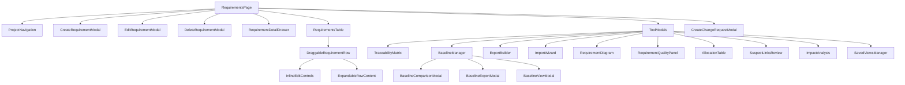
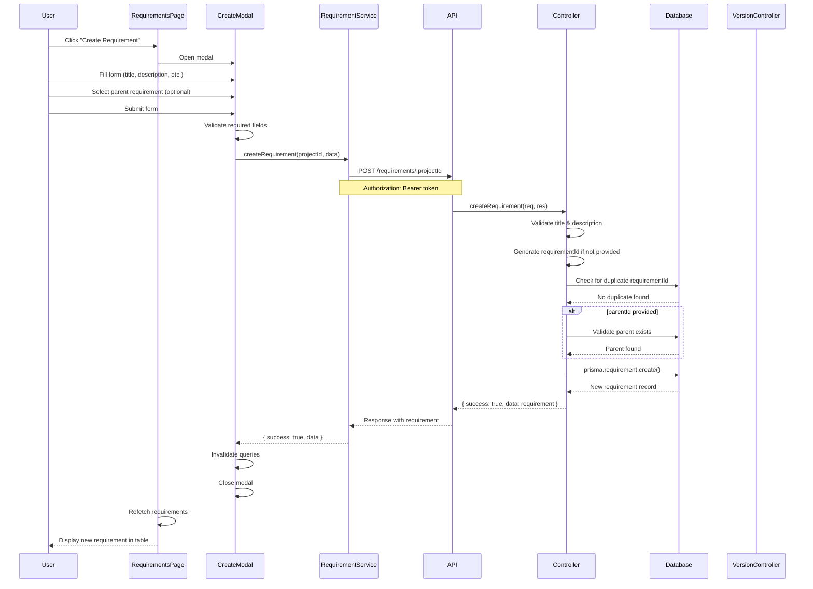
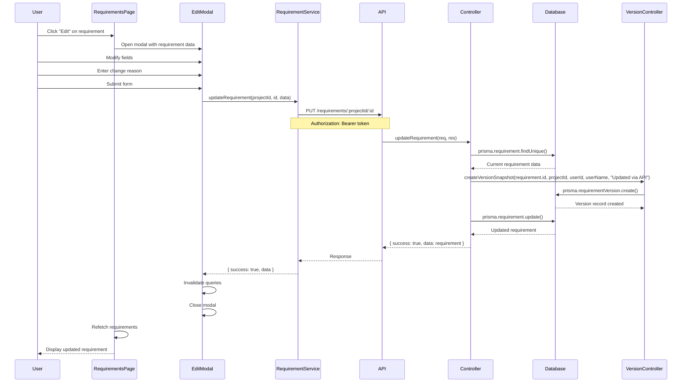
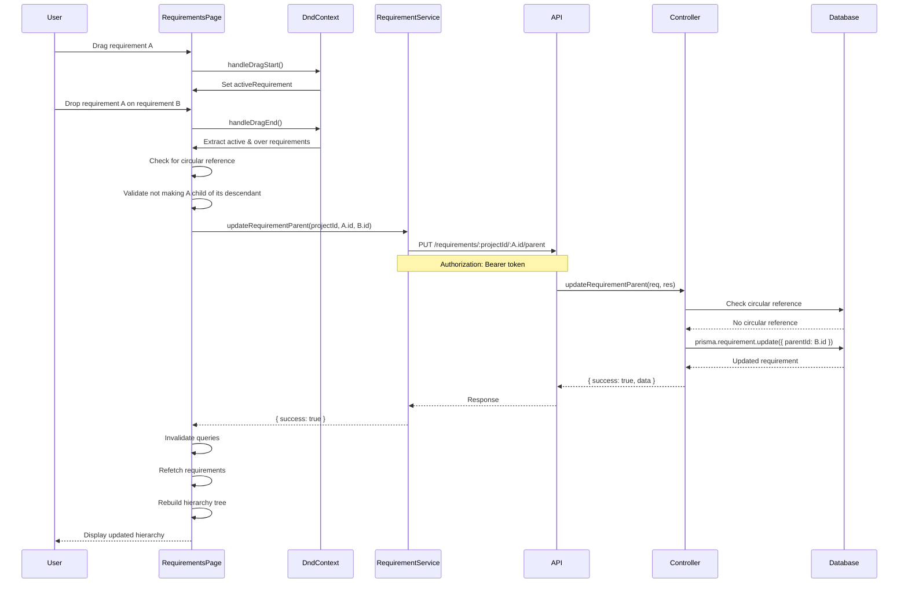
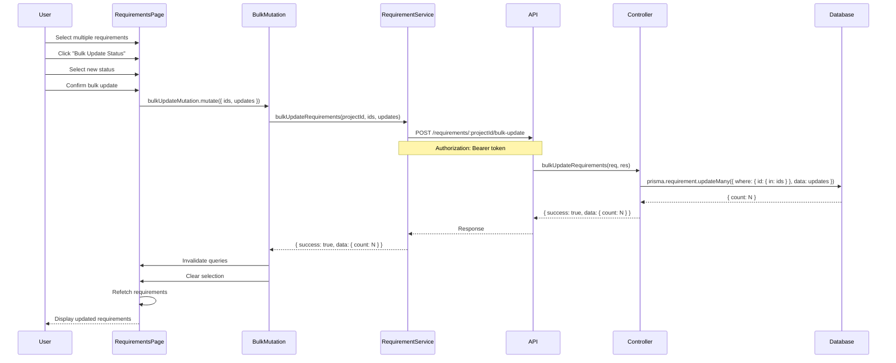
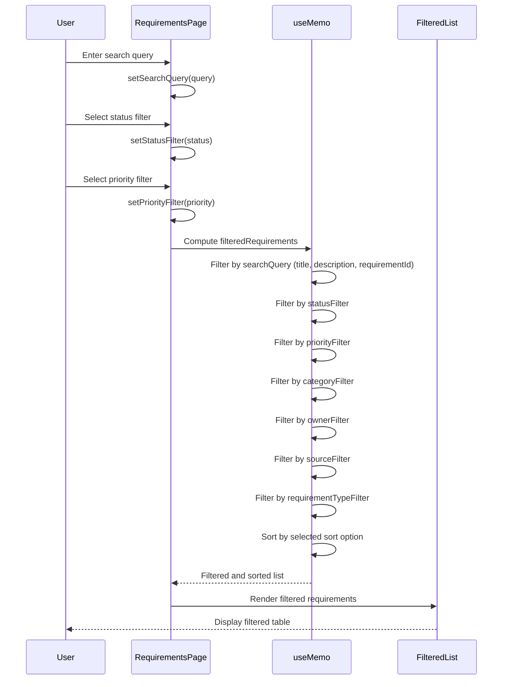

# Requirements Management - Complete Structure Documentation

## ⚠️ IMPORTANT MAINTENANCE NOTE

**This documentation file MUST be updated whenever any changes are made to the Requirements Management features, components, APIs, or data structures.**

When updating this file:
1. Update the relevant sections with the new changes
2. Update the "Last Updated" date at the bottom of this document
3. Delete any old versions of this file to avoid confusion
4. Ensure all code references and file paths are accurate
5. Update data flow diagrams if the architecture changes

**Failure to keep this document updated will result in outdated documentation that may mislead developers and agents.**

---

## Table of Contents

1. [Introduction and Overview](#1-introduction-and-overview)
2. [Architecture Overview](#2-architecture-overview)
3. [File Structure](#3-file-structure)
4. [Core Components Documentation](#4-core-components-documentation)
5. [State Management](#5-state-management)
6. [Backend API Documentation](#6-backend-api-documentation)
7. [Database Schema](#7-database-schema)
8. [Data Flow Diagrams](#8-data-flow-diagrams)
9. [Feature Details](#9-feature-details)
10. [Integration Points](#10-integration-points)
11. [Type Definitions](#11-type-definitions)
12. [Tool Integration](#12-tool-integration)
13. [Maintenance and Updates](#13-maintenance-and-updates)

---

## 1. Introduction and Overview

### 1.1 Purpose and Scope

The Requirements Management page provides a comprehensive interface for creating, managing, and tracking requirements throughout the engineering lifecycle. It follows industry-standard requirements management practices aligned with ISO/IEC/IEEE 29148 and DO-178C standards.

**Primary Goals:**
- Create and manage requirements with full lifecycle tracking
- Maintain hierarchical relationships between requirements
- Track traceability to functions, use cases, and other elements
- Support version control and baseline management
- Enable bulk operations for efficiency
- Provide quality analysis and validation tools
- Support import/export in standard formats (ReqIF, Excel, CSV)

**Key Features:**
- Hierarchical requirement structure with drag-and-drop reorganization
- Inline editing for quick updates
- Advanced filtering and search capabilities
- Bulk operations (update, delete, create change requests/issues)
- Traceability matrix visualization
- Baseline management and comparison
- Version history tracking
- Quality analysis panel
- Export/import functionality
- Requirement diagram visualization
- Suspect links review
- Allocation table for requirement-to-function mapping

### 1.2 Industry-Standard Alignment

The implementation follows established patterns from commercial requirements management tools:

- **DOORS**: Hierarchical structure, traceability matrix, baseline management
- **Jama Connect**: Version history, quality metrics, impact analysis
- **Polarion**: Lifecycle management, inline editing, bulk operations
- **ISO/IEC/IEEE 29148**: Requirement attributes, verification methods, acceptance criteria
- **DO-178C**: Traceability, verification status, change management

### 1.3 Key Capabilities

1. **Requirement Lifecycle Management**: Full lifecycle from draft to verified
2. **Hierarchical Organization**: Parent-child relationships with drag-and-drop
3. **Traceability**: Links to functions, use cases, parameters, diagrams
4. **Version Control**: Complete version history with change tracking
5. **Baseline Management**: Create, lock, and compare baselines
6. **Quality Analysis**: Automated quality checks and metrics
7. **Bulk Operations**: Efficient management of multiple requirements
8. **Import/Export**: Support for ReqIF, Excel, CSV formats
9. **Visualization**: Requirement diagrams and traceability matrices
10. **Change Management**: Integration with change requests and issues

---

## 2. Architecture Overview

### 2.1 Page Layout

The Requirements page uses a table-based layout with expandable rows and integrated tool panels:

```
┌─────────────────────────────────────────────────────────────────┐
│ Header: Search, Filters, Actions (Create, Export, Import, etc.) │
├─────────────────────────────────────────────────────────────────┤
│ Toolbar: Bulk Actions, View Options, Tools                      │
├─────────────────────────────────────────────────────────────────┤
│                                                                 │
│ Requirements Table                                             │
│ ┌───────────────────────────────────────────────────────────┐  │
│ │ [Checkbox] ID │ Title │ Priority │ Status │ Owner │ ... │  │
│ ├───────────────────────────────────────────────────────────┤  │
│ │ [✓] REQ-001  │ Title │ High     │ Draft  │ User  │ ... │  │
│ │   └─ REQ-002 │ Child │ Medium   │ Review │ User  │ ... │  │
│ │ [✓] REQ-003  │ Title │ Low      │ Done   │ User  │ ... │  │
│ └───────────────────────────────────────────────────────────┘  │
│                                                                 │
└─────────────────────────────────────────────────────────────────┘
```

**Layout Features:**
- **Header Section**: Search bar, filter controls, action buttons
- **Toolbar**: Bulk action buttons, view toggles, tool access
- **Table View**: Main requirements list with hierarchical display
- **Expandable Rows**: Show children, linked elements, details
- **Modals/Drawers**: Create, edit, delete, detail views
- **Tool Panels**: Traceability matrix, baseline manager, quality panel, etc.

### 2.2 Component Hierarchy



### 2.3 Technology Stack

**Frontend:**
- **React 18**: Component-based UI framework
- **TypeScript**: Type-safe JavaScript
- **React Query (TanStack Query)**: Server state management and caching
- **@dnd-kit**: Drag-and-drop functionality for hierarchy management
- **React Router**: Client-side routing
- **Tailwind CSS**: Utility-first CSS framework
- **Lucide React**: Icon library
- **date-fns**: Date formatting utilities
- **Rich Text Editor**: TipTap-based editor for descriptions

**Backend:**
- **Node.js**: JavaScript runtime
- **Express**: Web framework
- **TypeScript**: Type-safe backend code
- **Prisma**: ORM for database access
- **PostgreSQL**: Relational database
- **JWT**: Authentication tokens

**Shared:**
- **TypeScript Types**: Shared type definitions in `shared/types/`

---

## 3. File Structure

### 3.1 Frontend Structure

```
frontend/src/
├── pages/
│   └── Requirements/
│       └── RequirementsPage.tsx          # Main page component
│
├── components/
│   └── requirements/
│       ├── CreateRequirementModal.tsx    # Create requirement form
│       ├── EditRequirementModal.tsx      # Edit requirement form
│       ├── DeleteRequirementModal.tsx    # Delete confirmation
│       ├── RequirementDetailDrawer.tsx   # Side drawer with full details
│       ├── DraggableRequirementRow.tsx   # Sortable table row
│       │
│       ├── TraceabilityMatrix.tsx        # Traceability matrix tool
│       ├── SuspectLinksReview.tsx        # Review suspect links
│       ├── BaselineManager.tsx           # Baseline management
│       ├── BaselineComparisonModal.tsx   # Compare baselines
│       ├── BaselineExportModal.tsx       # Export baseline
│       ├── BaselineViewModal.tsx         # View baseline
│       │
│       ├── ExportBuilder.tsx             # Export wizard
│       ├── ImportWizard.tsx               # Import wizard
│       ├── RequirementDiagram.tsx        # Visual diagram
│       ├── RequirementQualityPanel.tsx   # Quality metrics
│       ├── AllocationTable.tsx           # Requirement-to-function mapping
│       ├── ImpactAnalysis.tsx            # Impact analysis tool
│       ├── RequirementVersionHistory.tsx # Version history viewer
│       └── SavedViewsManager.tsx         # Manage saved views
│
├── services/
│   └── requirement.service.ts            # API service for requirements
│
└── store/
    ├── statusDefinitionsStore.ts         # Status definitions
    └── lifecycleStore.ts                 # Lifecycle definitions
```

### 3.2 Backend Structure

```
backend/src/
├── controllers/
│   └── requirement.controller.ts         # Requirement CRUD operations
│
├── routes/
│   └── requirements.routes.ts           # API route definitions
│
└── middleware/
    └── auth.middleware.ts                # Authentication middleware

backend/prisma/
└── schema.prisma                         # Database schema (Requirement model)
```

### 3.3 Shared Types

```
shared/types/
├── engineering.types.ts                  # Requirement, Baseline types
├── traceability.types.ts                 # TraceLink types
└── api.types.ts                          # API response types
```

---

## 4. Core Components Documentation

### 4.1 Main Page Component

**File**: `frontend/src/pages/Requirements/RequirementsPage.tsx`

**Responsibilities:**
- Orchestrates the entire requirements management interface
- Manages requirement data fetching and caching
- Handles filtering, sorting, and search
- Coordinates modal and drawer states
- Manages bulk selection and operations
- Handles drag-and-drop for hierarchy reorganization
- Integrates with all tool components

**Key State:**
```typescript
// Data state
const [requirements, setRequirements] = useState<Requirement[]>([])
const [expandedRows, setExpandedRows] = useState<Set<string>>(new Set())
const [requirementData, setRequirementData] = useState<Map<string, ExpandedRow>>(new Map())
const [selectedRequirements, setSelectedRequirements] = useState<Set<string>>(new Set())

// Modal/Drawer states
const [isCreateModalOpen, setIsCreateModalOpen] = useState(false)
const [editingRequirement, setEditingRequirement] = useState<Requirement | null>(null)
const [deleteConfirmation, setDeleteConfirmation] = useState<Requirement | null>(null)
const [detailRequirement, setDetailRequirement] = useState<Requirement | null>(null)
const [parentRequirement, setParentRequirement] = useState<Requirement | null>(null)

// Tool states
const [isTraceMatrixOpen, setIsTraceMatrixOpen] = useState(false)
const [isSuspectReviewOpen, setIsSuspectReviewOpen] = useState(false)
const [isBaselineManagerOpen, setIsBaselineManagerOpen] = useState(false)
const [isExportOpen, setIsExportOpen] = useState(false)
const [isImportOpen, setIsImportOpen] = useState(false)
const [isDiagramOpen, setIsDiagramOpen] = useState(false)
const [isAllocationTableOpen, setIsAllocationTableOpen] = useState(false)
const [isQualityPanelOpen, setIsQualityPanelOpen] = useState(false)

// Filter states
const [searchQuery, setSearchQuery] = useState('')
const [statusFilter, setStatusFilter] = useState<string>('all')
const [priorityFilter, setPriorityFilter] = useState<string>('all')
const [categoryFilter, setCategoryFilter] = useState<string>('all')
const [ownerFilter, setOwnerFilter] = useState<string>('all')
const [sourceFilter, setSourceFilter] = useState<string>('all')
const [requirementTypeFilter, setRequirementTypeFilter] = useState<string>('all')

// Inline editing state
const [inlineEdit, setInlineEdit] = useState<InlineEditState | null>(null)

// Drag and drop state
const [activeRequirement, setActiveRequirement] = useState<Requirement | null>(null)
```

**Data Fetching:**
```typescript
// Requirements
const { data: requirements = [], isLoading } = useQuery({
  queryKey: ['requirements', projectId],
  queryFn: async () => {
    const response = await requirementService.getRequirements(projectId)
    return response.success && response.data ? response.data : []
  },
  enabled: !!projectId,
})

// Related data for expanded rows
const { data: functions = [] } = useQuery(['functions', projectId], ...)
const { data: traceLinks = [] } = useQuery(['trace-links', projectId], ...)
const { data: issues = [] } = useQuery(['issues', projectId], ...)
const { data: changeRequests = [] } = useQuery(['change-requests', projectId], ...)
```

**Key Features:**
- **Hierarchical Display**: Builds tree structure from flat requirement list
- **Drag-and-Drop**: Reorganizes hierarchy via @dnd-kit
- **Inline Editing**: Quick edits for title, priority, status, owner, category
- **Bulk Operations**: Select multiple requirements for batch actions
- **Expandable Rows**: Shows children, linked functions, issues, change requests
- **Filtering**: Multiple filter criteria with search
- **Sorting**: Sort by ID, title, priority, status, owner, etc.

### 4.2 Create Requirement Modal

**File**: `frontend/src/components/requirements/CreateRequirementModal.tsx`

**Purpose:** Form for creating new requirements with comprehensive fields.

**Fields:**
- **Basic**: Title (required), Description (required, rich text)
- **Identification**: Requirement ID (auto-generated or manual), Category
- **Classification**: Requirement Type, Requirement Level, Priority, Risk, Complexity
- **Lifecycle**: Status, Stage, Owner
- **Verification**: Verification Method, Acceptance Criteria, Verification Status
- **Metadata**: Source, Tags, Related Documents, Rationale, Assumptions
- **Relationships**: Parent Requirement (for hierarchy)
- **Dependencies**: Dependencies array, Conflicts array, Stakeholders array

**Features:**
- **Template Support**: Pre-fill from requirement templates
- **Auto-ID Generation**: Automatic requirement ID based on category
- **Rich Text Editor**: TipTap-based editor for descriptions
- **Validation**: Required field validation, duplicate ID checking
- **Lifecycle Integration**: Initial status from lifecycle definitions

**Data Flow:**
1. User fills form
2. Validates required fields
3. Generates requirement ID if not provided
4. Calls `requirementService.createRequirement(projectId, data)`
5. Invalidates queries to refresh list
6. Closes modal

### 4.3 Edit Requirement Modal

**File**: `frontend/src/components/requirements/EditRequirementModal.tsx`

**Purpose:** Form for editing existing requirements.

**Features:**
- Pre-populated with current requirement data
- Same fields as Create modal
- Version tracking: Creates version snapshot on save
- Change reason: Optional field for documenting changes
- Rich text editor for description updates

**Version Creation:**
On save, automatically creates a `RequirementVersion` record:
- Captures current state as snapshot
- Records changedBy and changedByName from authenticated user
- Records changeReason as "Updated via API" (hardcoded in controller)
- Increments version number

### 4.4 Requirement Detail Drawer

**File**: `frontend/src/components/requirements/RequirementDetailDrawer.tsx`

**Purpose:** Side drawer showing comprehensive requirement details.

**Sections:**
1. **Basic Information**: ID, title, description, type, level
2. **Lifecycle**: Status, stage, owner, priority
3. **Verification**: Method, criteria, status, date, notes
4. **Relationships**: Parent, children, dependencies, conflicts
5. **Traceability**: Linked functions, use cases, diagrams
6. **Comments**: Thread of requirement comments
7. **Attachments**: File attachments
8. **Version History**: List of all versions
9. **Metadata**: Tags, source, stakeholders, rationale, assumptions

**Features:**
- Slide-in drawer from right side
- Edit button opens EditRequirementModal
- Delete button opens DeleteRequirementModal
- View linked elements with navigation
- Add comments inline
- View/download attachments

### 4.5 Draggable Requirement Row

**File**: `frontend/src/components/requirements/DraggableRequirementRow.tsx`

**Purpose:** Sortable table row component for drag-and-drop hierarchy management.

**Features:**
- **Drag Handle**: Grip icon for initiating drag
- **Checkbox**: For bulk selection
- **Expand/Collapse**: Toggle children visibility
- **Inline Editing**: Click fields to edit inline
- **Actions Menu**: Edit, delete, create change request, etc.
- **Visual Indicators**: Status badges, priority colors, type icons

**Drag-and-Drop:**
- Uses `@dnd-kit` for drag functionality
- Prevents circular references (can't make requirement child of its descendant)
- Updates parent relationship on drop
- Visual feedback during drag

### 4.6 Traceability Matrix

**File**: `frontend/src/components/requirements/TraceabilityMatrix.tsx`

**Purpose:** Interactive matrix showing traceability relationships.

**Matrix Types:**
1. **Requirements ↔ Functions**: Shows which requirements are satisfied by which functions
2. **Requirements ↔ Requirements**: Shows requirement-to-requirement relationships

**Features:**
- **Cell Status**: Linked (green), Suspect (amber), None (gray)
- **Click to Link**: Click empty cell to create trace link
- **Click to View**: Click linked cell to view/edit link
- **Filters**: Show all, linked only, unlinked only, suspect only
- **Link Types**: satisfies, implements, verifies, derives, refines, etc.
- **Export**: Export matrix to CSV/Excel

**Data Sources:**
- Requirements: `requirementService.getRequirements(projectId)`
- Functions: `functionService.getFunctions(projectId)`
- Trace Links: `traceabilityService.getTraceLinks(projectId)`

### 4.7 Baseline Manager

**File**: `frontend/src/components/requirements/BaselineManager.tsx`

**Purpose:** Create, manage, and compare requirement baselines.

**Features:**
- **Create Baseline**: Select requirements or use all
- **Lock Baseline**: Prevent further changes
- **View Baseline**: View snapshot of requirements at baseline time
- **Compare Baselines**: Side-by-side comparison of two baselines
- **Export Baseline**: Export baseline to ReqIF or Excel
- **Baseline Status**: Active, Locked, Archived

**Baseline Creation:**
1. User selects requirements (or uses all)
2. Creates `Baseline` record
3. Creates `BaselineItem` for each requirement with snapshot
4. Snapshot contains full requirement JSON at time of baseline

**Baseline Comparison:**
- Shows requirements that changed between baselines
- Highlights added, removed, modified requirements
- Shows field-level changes (title, priority, status, etc.)

### 4.8 Export Builder

**File**: `frontend/src/components/requirements/ExportBuilder.tsx`

**Purpose:** Wizard for exporting requirements in various formats.

**Supported Formats:**
- **ReqIF**: Requirements Interchange Format (ISO/IEC 42010)
- **Excel**: Microsoft Excel (.xlsx)
- **CSV**: Comma-separated values
- **PDF**: Portable Document Format

**Export Options:**
- **Scope**: All requirements, selected, filtered, baseline
- **Fields**: Select which fields to include
- **Formatting**: Include hierarchy, include comments, include attachments
- **Filtering**: Apply current filters to export

### 4.9 Import Wizard

**File**: `frontend/src/components/requirements/ImportWizard.tsx`

**Purpose:** Import requirements from external files.

**Supported Formats:**
- **ReqIF**: Requirements Interchange Format
- **Excel**: Microsoft Excel (.xlsx)
- **CSV**: Comma-separated values

**Import Process:**
1. Upload file
2. Parse file and extract requirements
3. Map columns to requirement fields
4. Preview imported requirements
5. Validate data (check for duplicates, required fields)
6. Import (create requirements, handle errors)

**Features:**
- **Column Mapping**: Map file columns to requirement fields
- **Validation**: Check for duplicates, missing required fields
- **Preview**: Show preview before importing
- **Error Handling**: Report import errors with details
- **Bulk Import**: Import multiple requirements at once

### 4.10 Requirement Diagram

**File**: `frontend/src/components/requirements/RequirementDiagram.tsx`

**Purpose:** Visual diagram showing requirements and relationships.

**Features:**
- **Node Layout**: Requirements as nodes
- **Hierarchy Visualization**: Parent-child relationships
- **Trace Links**: Shows relationships to functions, use cases
- **Type Color Coding**: Different colors for requirement types
- **Interactive**: Click nodes to view details, drag to rearrange

**Data Sources:**
- Requirements: `requirementService.getRequirements(projectId)`
- Trace Links: `traceabilityService.getTraceLinks(projectId)`

### 4.11 Requirement Quality Panel

**File**: `frontend/src/components/requirements/RequirementQualityPanel.tsx`

**Purpose:** Quality analysis and metrics for requirements.

**Metrics:**
- **Completeness**: Requirements with missing fields
- **Traceability**: Requirements without trace links
- **Verification**: Requirements without verification method
- **Clarity**: Requirements with vague descriptions
- **Consistency**: Conflicting requirements
- **Coverage**: Requirements without children (leaf nodes)

**Quality Checks:**
- Missing required fields
- Unlinked requirements
- Requirements without verification
- Circular dependencies
- Conflicting requirements
- Duplicate requirement IDs

### 4.12 Allocation Table

**File**: `frontend/src/components/requirements/AllocationTable.tsx`

**Purpose:** Table showing requirement-to-function allocation.

**Features:**
- **Matrix View**: Requirements (rows) × Functions (columns)
- **Allocation Status**: Allocated, Partial, Not Allocated
- **Link Management**: Create/edit/delete allocation links
- **Filtering**: Filter by requirement type, function status
- **Export**: Export allocation matrix

### 4.13 Suspect Links Review

**File**: `frontend/src/components/requirements/SuspectLinksReview.tsx`

**Purpose:** Review and resolve suspect trace links.

**Features:**
- **Suspect Detection**: Identifies links that may be broken
- **Review Interface**: List of suspect links with details
- **Resolution Actions**: Confirm link, delete link, update link
- **Bulk Resolution**: Resolve multiple links at once

**Suspect Link Criteria:**
- Source or target element deleted
- Link type mismatch
- Circular references
- Invalid relationships

### 4.14 Impact Analysis

**File**: `frontend/src/components/requirements/ImpactAnalysis.tsx`

**Purpose:** Analyze impact of requirement changes.

**Features:**
- **Select Requirement**: Choose requirement to analyze
- **Impact Chain**: Show all affected elements via trace links
- **Affected Elements**: Functions, use cases, diagrams, other requirements
- **Impact Severity**: Calculate impact level (low, medium, high, critical)
- **Impact Report**: Generate report of potential impacts

### 4.15 Requirement Version History

**File**: `frontend/src/components/requirements/RequirementVersionHistory.tsx`

**Purpose:** View version history of a requirement.

**Features:**
- **Version List**: Chronological list of all versions
- **Version Comparison**: Compare any two versions
- **Change Highlighting**: Highlight changed fields
- **Change Reason**: Display reason for each change
- **Restore Version**: Restore requirement to previous version

### 4.16 Saved Views Manager

**File**: `frontend/src/components/requirements/SavedViewsManager.tsx`

**Purpose:** Manage saved views (filters, columns, sorting).

**Features:**
- **Save View**: Save current filter/column/sort configuration
- **Load View**: Apply saved view
- **View Types**: Personal, Project, Organization
- **View Management**: Edit, delete, share views

---

## 5. State Management

### 5.1 React Query State

**Primary State Management**: Uses React Query (TanStack Query) for server state.

**Query Keys:**
```typescript
['requirements', projectId]                    // Requirements list
['requirements', projectId, requirementId]     // Single requirement
['functions', projectId]                       // Functions (for linking)
['trace-links', projectId]                     // Trace links
['issues', projectId]                          // Issues (for linking)
['change-requests', projectId]                  // Change requests (for linking)
['templates', projectId]                        // Requirement templates
['baselines', projectId]                        // Baselines
```

**Mutations:**
```typescript
// Create requirement
createRequirementMutation = useMutation({
  mutationFn: (data) => requirementService.createRequirement(projectId, data),
  onSuccess: () => {
    queryClient.invalidateQueries(['requirements', projectId])
  }
})

// Update requirement
updateRequirementMutation = useMutation({...})

// Delete requirement
deleteRequirementMutation = useMutation({...})

// Bulk update
bulkUpdateMutation = useMutation({...})

// Update parent (drag-and-drop)
updateParentMutation = useMutation({...})

// Inline update
inlineUpdateMutation = useMutation({...})
```

### 5.2 Local Component State

**RequirementsPage State:**
- **UI State**: Modal visibility, drawer state, expanded rows
- **Selection State**: Selected requirements for bulk operations
- **Filter State**: Current filter values
- **Edit State**: Inline editing state
- **Drag State**: Active drag item

**State Updates:**
- Local state updates immediately for UI responsiveness
- Server state updates via React Query mutations
- Cache invalidation triggers refetch

### 5.3 Zustand Stores

**Status Definitions Store** (`statusDefinitionsStore.ts`):
- Stores project-specific status definitions
- Used for status dropdowns and validation

**Lifecycle Store** (`lifecycleStore.ts`):
- Stores lifecycle definitions
- Used for initial status assignment

---

## 6. Backend API Documentation

### 6.1 Requirement Controller

**File**: `backend/src/controllers/requirement.controller.ts`

**Base Path**: `/api/v1/requirements`

All routes require authentication via `authenticateToken` middleware.

#### 6.1.1 Get All Requirements

**Endpoint**: `GET /api/v1/requirements/:projectId`

**Description:** Retrieves all requirements for a project with hierarchical relationships.

**Request:**
- Path Parameter: `projectId` (string, required)
- Headers: `Authorization: Bearer <token>`

**Response (200 OK):**
```json
{
  "success": true,
  "data": [
    {
      "id": "uuid",
      "projectId": "uuid",
      "requirementId": "REQ-001",
      "title": "Requirement Title",
      "description": "Requirement description",
      "parentId": "uuid",
      "parent": { "id": "uuid", "requirementId": "REQ-000", "title": "Parent" },
      "children": [
        { "id": "uuid", "requirementId": "REQ-002", "title": "Child", "priority": "high", "status": "draft" }
      ],
      "priority": "high",
      "status": "draft",
      "stage": "requirements",
      "owner": "user@example.com",
      "verificationMethod": "Test",
      "acceptanceCriteria": "Criteria",
      "source": "Customer",
      "category": "Functional",
      "relatedDocuments": [],
      "tags": ["tag1", "tag2"],
      "requirementType": "functional",
      "requirementLevel": "system",
      "risk": "medium",
      "complexity": "moderate",
      "rationale": "Rationale text",
      "assumptions": "Assumptions text",
      "dependencies": ["req-id-1", "req-id-2"],
      "conflicts": [],
      "stakeholders": ["stakeholder1"],
      "verificationStatus": "not_verified",
      "verificationDate": null,
      "verificationNotes": null,
      "comments": [],
      "attachments": [],
      "createdAt": "2024-01-01T00:00:00Z",
      "updatedAt": "2024-01-01T00:00:00Z"
    }
  ]
}
```

**Ordering:**
- Primary: `parentId` (ascending) - parents before children
- Secondary: `requirementId` (ascending)
- Tertiary: `createdAt` (descending)

#### 6.1.2 Get Single Requirement

**Endpoint**: `GET /api/v1/requirements/:projectId/:requirementId`

**Description:** Retrieves a single requirement by ID or requirementId.

**Request:**
- Path Parameters:
  - `projectId` (string, required)
  - `requirementId` (string, required) - Can be UUID or requirementId string
- Headers: `Authorization: Bearer <token>`

**Response (200 OK):**
```json
{
  "success": true,
  "data": {
    "id": "uuid",
    "projectId": "uuid",
    "requirementId": "REQ-001",
    "title": "Requirement Title",
    "description": "Full description",
    "parent": { "id": "uuid", "requirementId": "REQ-000", "title": "Parent", "description": "..." },
    "children": [...],
    "comments": [...],
    "attachments": [...],
    ...
  }
}
```

**Response (404 Not Found):**
```json
{
  "success": false,
  "error": "Requirement not found"
}
```

#### 6.1.3 Get Requirement Children

**Endpoint**: `GET /api/v1/requirements/:projectId/:requirementId/children`

**Description:** Retrieves all child requirements of a specific requirement.

**Request:**
- Path Parameters:
  - `projectId` (string, required)
  - `requirementId` (string, required)
- Headers: `Authorization: Bearer <token>`

**Response (200 OK):**
```json
{
  "success": true,
  "data": [
    {
      "id": "uuid",
      "requirementId": "REQ-002",
      "title": "Child Requirement",
      ...
    }
  ]
}
```

#### 6.1.4 Create Requirement

**Endpoint**: `POST /api/v1/requirements/:projectId`

**Description:** Creates a new requirement with automatic ID generation and validation.

**Request:**
- Path Parameter: `projectId` (string, required)
- Headers: `Authorization: Bearer <token>`
- Body:
```json
{
  "requirementId": "REQ-001",  // Optional: auto-generated if not provided
  "title": "Requirement Title",  // Required
  "description": "Description",  // Required
  "parentId": "uuid",  // Optional: for hierarchy
  "priority": "high",  // Optional: defaults to "medium"
  "status": "draft",  // Optional: defaults to lifecycle initial status
  "stage": "requirements",
  "owner": "user@example.com",
  "verificationMethod": "Test",
  "acceptanceCriteria": "Criteria",
  "source": "Customer",
  "category": "Functional",
  "relatedDocuments": [],
  "tags": ["tag1"],
  "requirementType": "functional",
  "requirementLevel": "system",
  "risk": "medium",
  "complexity": "moderate",
  "rationale": "Rationale",
  "assumptions": "Assumptions",
  "dependencies": ["req-id-1"],
  "conflicts": [],
  "stakeholders": ["stakeholder1"]
}
```

**Validation:**
- `title` is required
- `description` is required
- `requirementId` must be unique within project (if provided)
- `parentId` must exist in project (if provided)
- Circular reference check: prevents making requirement child of its descendant

**ID Generation:**
If `requirementId` not provided:
1. Uses category prefix: `REQ-{CATEGORY.substring(0,4).toUpperCase()}`
2. If no category: uses `REQ`
3. Finds highest number for prefix
4. Generates next sequential ID: `{PREFIX}-{NUMBER}` (padded to 3 digits)

**Response (201 Created):**
```json
{
  "success": true,
  "data": {
    "id": "uuid",
    "projectId": "uuid",
    "requirementId": "REQ-001",
    ...
  }
}
```

**Response (400 Bad Request):**
```json
{
  "success": false,
  "error": "Title is required"
}
```
or
```json
{
  "success": false,
  "error": "Requirement ID \"REQ-001\" already exists in this project"
}
```

#### 6.1.5 Update Requirement

**Endpoint**: `PUT /api/v1/requirements/:projectId/:requirementId`

**Description:** Updates an existing requirement and creates a version snapshot.

**Request:**
- Path Parameters:
  - `projectId` (string, required)
  - `requirementId` (string, required)
- Headers: `Authorization: Bearer <token>`
- Body (all fields optional):
```json
{
  "title": "Updated Title",
  "description": "Updated description",
  "priority": "critical",
  "status": "approved",
  "owner": "newowner@example.com",
  ...
}
```

**Version Creation:**
Automatically creates `RequirementVersion` record:
- Captures current state before update
- Records `changedBy` from `req.user?.id`
- Records `changedByName` from `req.user?.name`
- Records `changeReason` as "Updated via API" (hardcoded in controller)
- Increments version number
- Wrapped in try-catch to prevent version creation failures from blocking updates

**Response (200 OK):**
```json
{
  "success": true,
  "data": {
    "id": "uuid",
    "requirementId": "REQ-001",
    "title": "Updated Title",
    ...
  }
}
```

#### 6.1.6 Update Requirement Parent

**Endpoint**: `PUT /api/v1/requirements/:projectId/:requirementId/parent`

**Description:** Updates the parent relationship (used for drag-and-drop).

**Request:**
- Path Parameters:
  - `projectId` (string, required)
  - `requirementId` (string, required)
- Headers: `Authorization: Bearer <token>`
- Body:
```json
{
  "newParentId": "uuid"  // null to remove parent
}
```

**Validation:**
- Prevents circular references
- Validates parent exists in project

**Response (200 OK):**
```json
{
  "success": true,
  "data": { /* Updated requirement */ }
}
```

#### 6.1.7 Delete Requirement

**Endpoint**: `DELETE /api/v1/requirements/:projectId/:requirementId`

**Description:** Deletes a requirement and handles children.

**Request:**
- Path Parameters:
  - `projectId` (string, required)
  - `requirementId` (string, required)
- Headers: `Authorization: Bearer <token>`

**Cascade Behavior:**
- Children's `parentId` set to `null` (orphaned, not deleted)
- Comments deleted (cascade)
- Attachments deleted (cascade)
- Trace links referencing requirement remain (for audit trail)

**Response (200 OK):**
```json
{
  "success": true,
  "message": "Requirement deleted successfully"
}
```

#### 6.1.8 Bulk Update Requirements

**Endpoint**: `POST /api/v1/requirements/:projectId/bulk-update`

**Description:** Updates multiple requirements with the same changes.

**Request:**
- Path Parameter: `projectId` (string, required)
- Headers: `Authorization: Bearer <token>`
- Body:
```json
{
  "requirementIds": ["uuid1", "uuid2", "uuid3"],
  "updates": {
    "status": "approved",
    "owner": "newowner@example.com"
  }
}
```

**Response (200 OK):**
```json
{
  "success": true,
  "data": {
    "count": 3
  }
}
```

#### 6.1.9 Bulk Import Requirements

**Endpoint**: `POST /api/v1/requirements/:projectId/bulk-import`

**Description:** Imports multiple requirements from external format. Supports both creating new requirements and updating existing ones.

**Request:**
- Path Parameter: `projectId` (string, required)
- Headers: `Authorization: Bearer <token>`
- Body:
```json
{
  "create": [
    {
      "requirementId": "REQ-001",
      "title": "Title",
      "description": "Description",
      ...
    }
  ],
  "update": [
    {
      "id": "uuid",
      "data": {
        "title": "Updated Title",
        "status": "approved",
        ...
      }
    }
  ]
}
```

**Fields:**
- `create` (optional): Array of `CreateRequirementDto` objects for new requirements
- `update` (optional): Array of objects with `id` (requirement UUID) and `data` (partial `UpdateRequirementDto`)

**Response (200 OK):**
```json
{
  "success": true,
  "data": {
    "created": 10,
    "updated": 5,
    "skipped": 2,
    "errors": [
      { "row": 1, "errors": ["Duplicate ID", "Missing title"] }
    ]
  }
}
```

#### 6.1.10 Create Requirement Comment

**Endpoint**: `POST /api/v1/requirements/:projectId/:requirementId/comments`

**Description:** Adds a comment to a requirement.

**Request:**
- Path Parameters:
  - `projectId` (string, required)
  - `requirementId` (string, required)
- Headers: `Authorization: Bearer <token>`
- Body:
```json
{
  "content": "Comment text"
}
```

**Response (201 Created):**
```json
{
  "success": true,
  "data": {
    "id": "uuid",
    "requirementId": "uuid",
    "projectId": "uuid",
    "content": "Comment text",
    "authorId": "uuid",
    "authorName": "User Name",
    "createdAt": "2024-01-01T00:00:00Z",
    "updatedAt": "2024-01-01T00:00:00Z"
  }
}
```

#### 6.1.11 Delete Requirement Comment

**Endpoint**: `DELETE /api/v1/requirements/:projectId/comments/:commentId`

**Description:** Deletes a requirement comment.

**Request:**
- Path Parameters:
  - `projectId` (string, required)
  - `commentId` (string, required)
- Headers: `Authorization: Bearer <token>`

**Response (200 OK):**
```json
{
  "success": true,
  "message": "Comment deleted successfully"
}
```

### 6.2 API Routes

**File**: `backend/src/routes/requirements.routes.ts`

**Registration**: Registered in `backend/src/routes/index.ts` as:
```typescript
router.use('/requirements', requirementsRoutes)
```

**Route Definitions:**
```typescript
// All routes use authenticateToken middleware
router.use(authenticateToken)

// Get all requirements for a project
router.get('/:projectId', getRequirements)

// Get a single requirement
router.get('/:projectId/:requirementId', getRequirement)

// Get requirement children
router.get('/:projectId/:requirementId/children', getRequirementChildren)

// Create a new requirement
router.post('/:projectId', createRequirement)

// Update a requirement
router.put('/:projectId/:requirementId', updateRequirement)

// Update requirement parent
router.put('/:projectId/:requirementId/parent', updateRequirementParent)

// Delete a requirement
router.delete('/:projectId/:requirementId', deleteRequirement)

// Bulk update requirements
router.post('/:projectId/bulk-update', bulkUpdateRequirements)

// Bulk import requirements
router.post('/:projectId/bulk-import', bulkImportRequirements)

// Create requirement comment
router.post('/:projectId/:requirementId/comments', createRequirementComment)

// Delete requirement comment
router.delete('/:projectId/comments/:commentId', deleteRequirementComment)
```

### 6.3 API Service (Frontend)

**File**: `frontend/src/services/requirement.service.ts`

**Purpose:** Client-side service for requirement API calls with error handling.

**Methods:**

```typescript
// Get all requirements for a project
async getRequirements(projectId: string): Promise<ApiResponse<Requirement[]>>

// Get a single requirement by ID
async getRequirement(projectId: string, requirementId: string): Promise<ApiResponse<Requirement>>

// Create a new requirement
async createRequirement(projectId: string, data: CreateRequirementDto): Promise<ApiResponse<Requirement>>

// Update an existing requirement
async updateRequirement(projectId: string, requirementId: string, data: UpdateRequirementDto): Promise<ApiResponse<Requirement>>

// Delete a requirement
async deleteRequirement(projectId: string, requirementId: string): Promise<ApiResponse<void>>

// Get requirement children
async getRequirementChildren(projectId: string, requirementId: string): Promise<ApiResponse<Requirement[]>>

// Update requirement parent
async updateRequirementParent(projectId: string, requirementId: string, newParentId: string | null): Promise<ApiResponse<Requirement>>

// Bulk update requirements
async bulkUpdateRequirements(projectId: string, requirementIds: string[], updates: Partial<UpdateRequirementDto>): Promise<ApiResponse<{ count: number }>>

// Create requirement comment
async createRequirementComment(projectId: string, requirementId: string, content: string): Promise<ApiResponse<RequirementComment>>

// Delete requirement comment
async deleteRequirementComment(projectId: string, commentId: string): Promise<ApiResponse<void>>

// Bulk import requirements
async bulkImportRequirements(projectId: string, data: BulkImportRequest): Promise<ApiResponse<BulkImportResult>>
```

---

## 7. Database Schema

### 7.1 Requirement Model

**File**: `backend/prisma/schema.prisma`

**Model Definition:**
```prisma
model Requirement {
  id                String    @id @default(uuid())
  projectId         String
  requirementId     String?   @unique
  title             String
  description       String
  parentId          String?
  priority          String
  status            String
  stage             String
  owner             String?
  verificationMethod String?
  acceptanceCriteria String?
  source            String?
  category          String?
  relatedDocuments  String[]  @default([])
  tags              String[]  @default([])
  requirementType   String?   // functional, performance, interface, design_constraint, safety, security, usability, other
  requirementLevel  String?   // system, subsystem, component, interface
  risk              String?   // low, medium, high, critical
  complexity        String?   // simple, moderate, complex
  rationale         String?   // why the requirement exists
  assumptions       String?  // assumptions related to the requirement
  dependencies      String[]  @default([]) // JSON array of requirement IDs this depends on
  conflicts         String[]  @default([]) // JSON array of conflicting requirement IDs
  stakeholders      String[]  @default([]) // JSON array of stakeholder names/IDs
  verificationStatus String?  // not_verified, verified, failed
  verificationDate  DateTime?
  verificationNotes String?
  createdAt         DateTime  @default(now())
  updatedAt         DateTime  @updatedAt

  project           Project       @relation(fields: [projectId], references: [id], onDelete: Cascade)
  parent            Requirement?  @relation("RequirementHierarchy", fields: [parentId], references: [id], onDelete: SetNull)
  children          Requirement[]  @relation("RequirementHierarchy")
  comments          RequirementComment[]
  attachments       RequirementAttachment[]

  @@unique([projectId, requirementId])
  @@index([projectId])
  @@index([parentId])
}
```

**Field Descriptions:**

- `id`: Unique identifier (UUID)
- `projectId`: Foreign key to Project table (cascade delete)
- `requirementId`: Human-readable requirement ID (e.g., "REQ-001"), unique
- `title`: Requirement title (required)
- `description`: Requirement description (required)
- `parentId`: Foreign key to parent requirement (for hierarchy)
- `priority`: Priority level (low, medium, high, critical)
- `status`: Current status (from lifecycle definitions)
- `stage`: Lifecycle stage
- `owner`: Owner email/identifier
- `verificationMethod`: Method for verification (Test, Analysis, Inspection, etc.)
- `acceptanceCriteria`: Criteria for acceptance
- `source`: Source of requirement (Customer, Regulatory, Internal, etc.)
- `category`: Requirement category
- `relatedDocuments`: Array of document references
- `tags`: Array of tags for categorization
- `requirementType`: Type classification (functional, performance, interface, etc.)
- `requirementLevel`: Level in system hierarchy (system, subsystem, component, interface)
- `risk`: Risk level (low, medium, high, critical)
- `complexity`: Complexity level (simple, moderate, complex)
- `rationale`: Why the requirement exists
- `assumptions`: Assumptions related to the requirement
- `dependencies`: Array of requirement IDs this depends on
- `conflicts`: Array of conflicting requirement IDs
- `stakeholders`: Array of stakeholder identifiers
- `verificationStatus`: Verification status (not_verified, verified, failed)
- `verificationDate`: Date of verification
- `verificationNotes`: Notes about verification
- `createdAt`: Timestamp of creation
- `updatedAt`: Timestamp of last update

**Relationships:**
- **Project**: Many-to-one (many requirements belong to one project)
  - Cascade delete: If project deleted, all requirements deleted
- **Parent**: Self-referential many-to-one (requirement can have one parent)
  - SetNull on delete: If parent deleted, children become orphaned (parentId = null)
- **Children**: Self-referential one-to-many (requirement can have many children)
- **Comments**: One-to-many (requirement can have many comments)
  - Cascade delete: If requirement deleted, comments deleted
- **Attachments**: One-to-many (requirement can have many attachments)
  - Cascade delete: If requirement deleted, attachments deleted

**Indexes:**
- `projectId`: For fast queries of all requirements in a project
- `parentId`: For fast queries of requirement children
- `[projectId, requirementId]`: Unique constraint ensuring requirementId uniqueness per project

### 7.2 Requirement Comment Model

```prisma
model RequirementComment {
  id            String   @id @default(uuid())
  requirementId String
  projectId     String
  content       String
  authorId      String?
  authorName    String?
  createdAt     DateTime @default(now())
  updatedAt     DateTime @updatedAt

  requirement   Requirement @relation(fields: [requirementId], references: [id], onDelete: Cascade)

  @@index([requirementId])
  @@index([projectId])
}
```

### 7.3 Requirement Attachment Model

```prisma
model RequirementAttachment {
  id            String   @id @default(uuid())
  requirementId String
  projectId     String
  fileName      String
  fileUrl       String
  fileSize      Int?
  mimeType      String?
  uploadedBy    String?
  uploadedByName String?
  createdAt     DateTime @default(now())

  requirement   Requirement @relation(fields: [requirementId], references: [id], onDelete: Cascade)

  @@index([requirementId])
  @@index([projectId])
}
```

### 7.4 Requirement Version Model

```prisma
model RequirementVersion {
  id            String   @id @default(uuid())
  requirementId String
  projectId     String
  version       Int
  title         String
  description   String
  priority      String
  status        String
  stage         String?
  owner         String?
  category      String?
  source        String?
  verificationMethod String?
  acceptanceCriteria String?
  tags          String[] @default([])
  changedBy     String?
  changedByName String?
  changeReason  String?
  snapshot      String?  // JSON string of full requirement data
  createdAt     DateTime @default(now())

  @@index([requirementId])
  @@index([projectId])
  @@index([version])
}
```

### 7.5 Baseline Models

```prisma
model Baseline {
  id          String   @id @default(uuid())
  projectId   String
  name        String
  description String?
  status      String   @default("active") // 'active' | 'locked' | 'archived'
  createdBy   String?
  createdByName String?
  lockedAt    DateTime?
  createdAt   DateTime @default(now())
  updatedAt   DateTime @updatedAt

  items       BaselineItem[]
  project     Project @relation(fields: [projectId], references: [id], onDelete: Cascade)

  @@index([projectId])
}

model BaselineItem {
  id          String   @id @default(uuid())
  baselineId  String
  requirementId String
  snapshot    String   // JSON string of requirement data at baseline time
  createdAt   DateTime @default(now())

  baseline    Baseline @relation(fields: [baselineId], references: [id], onDelete: Cascade)

  @@index([baselineId])
  @@index([requirementId])
}
```

---

## 8. Data Flow Diagrams

### 8.1 Complete Data Flow: Requirement Creation



### 8.2 Complete Data Flow: Requirement Update with Version



### 8.3 Data Flow: Drag-and-Drop Hierarchy Update



### 8.4 Data Flow: Bulk Operations



### 8.5 Data Flow: Filtering and Search



---

## 9. Feature Details

### 9.1 Hierarchical Structure

**Implementation:**
- Requirements have `parentId` field linking to parent requirement
- Self-referential relationship: `Requirement.parent` ↔ `Requirement.children`
- Tree structure built from flat list using `buildHierarchy()` function

**buildHierarchy Function:**
```typescript
const buildHierarchy = (reqs: Requirement[]): Requirement[] => {
  const reqMap = new Map<string, Requirement>()
  const rootReqs: Requirement[] = []
  
  // Create map of all requirements
  reqs.forEach(req => reqMap.set(req.id, { ...req, children: [] }))
  
  // Build tree
  reqs.forEach(req => {
    if (req.parentId) {
      const parent = reqMap.get(req.parentId)
      if (parent) {
        parent.children = parent.children || []
        parent.children.push(reqMap.get(req.id)!)
      }
    } else {
      rootReqs.push(reqMap.get(req.id)!)
    }
  })
  
  return rootReqs
}
```

**Display:**
- Root requirements shown at top level
- Children indented under parents
- Expand/collapse toggles visibility
- Visual indicators show hierarchy depth

**Drag-and-Drop:**
- Drag requirement to another to set as parent
- Prevents circular references
- Updates `parentId` field via API

### 9.2 Inline Editing

**Supported Fields:**
- `title`: Click to edit inline
- `priority`: Dropdown selection
- `status`: Dropdown selection
- `owner`: Text input
- `category`: Dropdown selection

**Implementation:**
- Click field to enter edit mode
- Input field appears with current value
- Press Enter or Tab to save
- Press Escape to cancel
- Auto-focus and select text on edit start

**State Management:**
```typescript
interface InlineEditState {
  requirementId: string
  field: 'title' | 'priority' | 'status' | 'owner' | 'category'
  value: string
}
```

**Save Flow:**
1. User edits value
2. Press Enter/Tab
3. Call `inlineUpdateMutation` with updates
4. API updates requirement
5. Invalidate queries
6. Exit edit mode

### 9.3 Bulk Operations

**Supported Operations:**
1. **Bulk Update**: Update multiple requirements with same changes
2. **Bulk Delete**: Delete multiple requirements
3. **Bulk Create Change Requests**: Create change requests for selected requirements
4. **Bulk Create Issues**: Create issues for selected requirements

**Selection:**
- Checkbox column for selecting requirements
- "Select All" checkbox in header
- Selection persists across filtering/sorting
- Clear selection after operation

**Bulk Update:**
- Select requirements
- Click "Bulk Update"
- Choose field to update (status, owner, priority, etc.)
- Enter new value
- Confirm update
- All selected requirements updated

**Bulk Delete:**
- Select requirements
- Click "Delete Selected"
- Confirm deletion
- All selected requirements deleted
- Children become orphaned (parentId = null)

### 9.4 Filtering and Search

**Search:**
- Full-text search across:
  - Requirement ID
  - Title
  - Description
  - Tags
- Case-insensitive matching
- Real-time filtering as user types

**Filters:**
- **Status**: Filter by requirement status
- **Priority**: Filter by priority level
- **Category**: Filter by category
- **Owner**: Filter by owner
- **Source**: Filter by source
- **Requirement Type**: Filter by type (functional, performance, etc.)

**Filter Logic:**
- All filters are AND conditions
- Search is applied first
- Then each filter is applied sequentially
- Results update in real-time

**Sorting:**
- Sort by: ID, Title, Priority, Status, Owner, Created Date, Updated Date
- Sort order: Ascending, Descending
- Sorting applied after filtering

### 9.5 Version History

**Version Creation:**
- Automatically created on every update
- Captures full requirement state as JSON snapshot
- Records:
  - Version number (auto-incremented)
  - Changed by (user ID)
  - Changed by name
  - Change reason (if provided)
  - Timestamp

**Version Viewing:**
- Access via RequirementDetailDrawer
- Shows chronological list of versions
- Each version shows:
  - Version number
  - Changed by
  - Change reason
  - Timestamp
  - Snapshot data

**Version Comparison:**
- Select two versions to compare
- Highlights changed fields
- Shows before/after values
- Side-by-side comparison view

**Version Restoration:**
- Restore requirement to previous version
- Creates new version with restored data
- Preserves version history

### 9.6 Baseline Management

**Baseline Creation:**
1. User selects requirements (or uses all)
2. Enters baseline name and description
3. System creates Baseline record
4. For each requirement, creates BaselineItem with snapshot
5. Snapshot contains full requirement JSON at baseline time

**Baseline States:**
- **Active**: Can be modified, requirements can be added/removed
- **Locked**: Cannot be modified, requirements frozen at baseline time
- **Archived**: Historical baseline, no longer active

**Baseline Comparison:**
- Select two baselines to compare
- Shows:
  - Requirements added in new baseline
  - Requirements removed in new baseline
  - Requirements modified between baselines
  - Field-level changes

**Baseline Export:**
- Export baseline to ReqIF format
- Export baseline to Excel
- Includes all requirement snapshots
- Preserves baseline metadata

### 9.7 Traceability

**Trace Link Types:**
- `satisfies`: Requirement satisfied by function/use case
- `implements`: Requirement implemented by function
- `verifies`: Requirement verified by test/verification
- `derives`: Requirement derived from another requirement
- `refines`: Requirement refines another requirement
- `copy`: Requirement copied from another
- `trace`: General trace relationship
- `allocate`: Requirement allocated to function/component

**Traceability Matrix:**
- Interactive matrix view
- Rows: Requirements
- Columns: Functions or Requirements
- Cells show link status:
  - Green: Linked
  - Amber: Suspect link
  - Gray: Not linked
- Click cell to create/edit link

**Suspect Links:**
- Links marked as suspect when:
  - Source or target element deleted
  - Link type mismatch detected
  - Circular reference detected
- Review interface shows all suspect links
- Can confirm, update, or delete suspect links

### 9.8 Quality Analysis

**Quality Metrics:**
- **Completeness**: Percentage of requirements with all required fields
- **Traceability**: Percentage of requirements with trace links
- **Verification**: Percentage of requirements with verification method
- **Clarity**: Requirements with vague or incomplete descriptions
- **Consistency**: Conflicting or duplicate requirements

**Quality Checks:**
- Missing required fields (title, description)
- Missing verification method
- Missing acceptance criteria
- Unlinked requirements
- Requirements without children (potential leaf nodes)
- Circular dependencies
- Conflicting requirements
- Duplicate requirement IDs

**Quality Panel:**
- Shows metrics dashboard
- Lists requirements failing quality checks
- Provides links to fix issues
- Generates quality report

---

## 10. Integration Points

### 10.1 Functions Management

**Integration:**
- Requirements can be linked to functions via trace links
- Traceability matrix shows requirement-to-function relationships
- Allocation table shows requirement-to-function allocation
- Functions page shows linked requirements

**Data Flow:**
```
Requirements Page → API → Database
                ↓
           (Shared Cache)
                ↓
    Functions Page (Shows linked requirements)
```

**Synchronization:**
- Both pages use React Query with shared cache keys
- Updates on one page invalidate cache, causing other to refetch
- Trace links stored in TraceLink table

### 10.2 Use Cases Management

**Integration:**
- Requirements can be linked to use cases
- Use cases can derive from requirements
- Traceability matrix includes use case relationships

**Data Flow:**
```
Requirements Page → Trace Links → Use Cases Page
```

### 10.3 Parameters Management

**Integration:**
- Parameters can be derived from requirements
- Parameter-Requirement Diagram shows relationships
- Requirements specify parameter constraints

**Data Flow:**
```
Requirements Page → Trace Links → Parameters Page
```

### 10.4 MBSE Models

**Integration:**
- Requirements appear in MBSE Models Model Browser
- Requirements grouped by type in MBSE Models
- Requirements Diagram visualizes requirements
- Changes on Requirements page reflect in MBSE Models

**Data Flow:**
```
Requirements Page → API → Database
                ↓
           (Shared Cache)
                ↓
    MBSE Models Page (Requirements Diagram, Model Browser)
```

### 10.5 Verification System

**Integration:**
- Requirements have verification status
- Verification methods specified on requirements
- Verification page shows requirement verification status
- Quality panel checks verification completeness

**Data Flow:**
```
Requirements Page → Verification Status → Verification Page
```

### 10.6 Change Requests

**Integration:**
- Requirements can generate change requests
- Change requests reference source requirements
- Bulk create change requests from requirements
- Change request page shows linked requirements

**Data Flow:**
```
Requirements Page → Create Change Request → Change Requests Page
```

### 10.7 Issues Management

**Integration:**
- Requirements can generate issues
- Issues reference source requirements
- Bulk create issues from requirements
- Issues page shows linked requirements

**Data Flow:**
```
Requirements Page → Create Issue → Issues Page
```

### 10.8 Traceability System

**Integration:**
- Requirements participate in traceability matrix
- Trace links connect requirements to other elements
- Suspect links review includes requirement links
- Impact analysis includes requirement impacts

**Data Flow:**
```
Requirements Page → Trace Links → Traceability System
```

---

## 11. Type Definitions

### 11.1 Shared Types

**File**: `shared/types/engineering.types.ts`

**RequirementType:**
```typescript
export type RequirementType = 
  | 'functional' 
  | 'performance' 
  | 'interface' 
  | 'design_constraint' 
  | 'safety' 
  | 'security' 
  | 'usability' 
  | 'other'
```

**RequirementLevel:**
```typescript
export type RequirementLevel = 
  | 'system' 
  | 'subsystem' 
  | 'component' 
  | 'interface'
```

**RiskLevel:**
```typescript
export type RiskLevel = 
  | 'low' 
  | 'medium' 
  | 'high' 
  | 'critical'
```

**ComplexityLevel:**
```typescript
export type ComplexityLevel = 
  | 'simple' 
  | 'moderate' 
  | 'complex'
```

**Requirement Interface:**
```typescript
export interface Requirement {
  id: string
  projectId: string
  requirementId?: string
  title: string
  description: string
  parentId?: string
  parent?: Requirement
  children?: Requirement[]
  priority: 'low' | 'medium' | 'high' | 'critical'
  status: string
  stage: string
  owner?: string
  verificationMethod?: string
  acceptanceCriteria?: string
  source?: string
  category?: string
  relatedDocuments?: string[]
  tags?: string[]
  requirementType?: RequirementType
  requirementLevel?: RequirementLevel
  risk?: RiskLevel
  complexity?: ComplexityLevel
  rationale?: string
  assumptions?: string
  dependencies?: string[]
  conflicts?: string[]
  stakeholders?: string[]
  verificationStatus?: 'not_verified' | 'verified' | 'failed'
  verificationDate?: string
  verificationNotes?: string
  comments?: RequirementComment[]
  attachments?: RequirementAttachment[]
  createdAt: string
  updatedAt: string
}
```

**CreateRequirementDto:**
```typescript
export interface CreateRequirementDto {
  requirementId?: string
  title: string  // Required
  description: string  // Required
  parentId?: string
  priority?: 'low' | 'medium' | 'high' | 'critical'
  status?: string
  stage?: string
  owner?: string
  verificationMethod?: string
  acceptanceCriteria?: string
  source?: string
  category?: string
  relatedDocuments?: string[]
  tags?: string[]
  requirementType?: RequirementType
  requirementLevel?: RequirementLevel
  risk?: RiskLevel
  complexity?: ComplexityLevel
  rationale?: string
  assumptions?: string
  dependencies?: string[]
  conflicts?: string[]
  stakeholders?: string[]
  verificationStatus?: 'not_verified' | 'verified' | 'failed'
  verificationDate?: string
  verificationNotes?: string
}
```

**Note:** The `assumptions`, `dependencies`, `conflicts`, and `stakeholders` fields are defined in the DTO and database schema, but are not currently extracted in the create endpoint controller. They will be stored as empty arrays if not provided. To fully support these fields, they need to be added to the controller's request body extraction.

**UpdateRequirementDto:**
```typescript
export interface UpdateRequirementDto {
  requirementId?: string
  title?: string
  description?: string
  parentId?: string | null
  priority?: 'low' | 'medium' | 'high' | 'critical'
  status?: string
  stage?: string
  owner?: string
  verificationMethod?: string
  acceptanceCriteria?: string
  source?: string
  category?: string
  relatedDocuments?: string[]
  tags?: string[]
  requirementType?: RequirementType
  requirementLevel?: RequirementLevel
  risk?: RiskLevel
  complexity?: ComplexityLevel
  rationale?: string
  assumptions?: string
  dependencies?: string[]
  conflicts?: string[]
  stakeholders?: string[]
  verificationStatus?: 'not_verified' | 'verified' | 'failed'
  verificationDate?: string
  verificationNotes?: string
}
```

**Note:** Version snapshots are automatically created on update, but `changeReason` is currently hardcoded as "Updated via API" in the controller. The `changeReason` field is not part of the DTO but is stored in the version record.

**RequirementComment:**
```typescript
export interface RequirementComment {
  id: string
  requirementId: string
  projectId: string
  content: string
  authorId?: string
  authorName?: string
  createdAt: string
  updatedAt: string
}
```

**RequirementAttachment:**
```typescript
export interface RequirementAttachment {
  id: string
  requirementId: string
  projectId: string
  fileName: string
  fileUrl: string
  fileSize?: number
  mimeType?: string
  uploadedBy?: string
  uploadedByName?: string
  createdAt: string
}
```

**RequirementVersion:**
```typescript
export interface RequirementVersion {
  id: string
  requirementId: string
  projectId: string
  version: number
  title: string
  description: string
  priority: string
  status: string
  stage?: string
  owner?: string
  category?: string
  source?: string
  verificationMethod?: string
  acceptanceCriteria?: string
  tags?: string[]
  changedBy?: string
  changedByName?: string
  changeReason?: string
  snapshot?: string  // JSON string of full requirement data
  createdAt: string
}
```

**Baseline:**
```typescript
export interface Baseline {
  id: string
  projectId: string
  name: string
  description?: string
  status: 'active' | 'locked' | 'archived'
  createdBy?: string
  createdByName?: string
  lockedAt?: string
  itemCount?: number
  createdAt: string
  updatedAt: string
}
```

**BaselineItem:**
```typescript
export interface BaselineItem {
  id: string
  baselineId: string
  requirementId: string
  snapshot: string  // JSON string of requirement data at baseline time
  createdAt: string
}
```

**BulkImportRequest:**
```typescript
export interface BulkImportRequest {
  create?: CreateRequirementDto[]  // New requirements to create
  update?: Array<{                 // Existing requirements to update
    id: string                      // Requirement UUID
    data: Partial<UpdateRequirementDto>
  }>
}
```

**BulkImportResult:**
```typescript
export interface BulkImportResult {
  created: number                  // Number of requirements created
  updated: number                  // Number of requirements updated
  skipped: number                  // Number of requirements skipped
  errors: Array<{
    row: number                    // Row number in import file
    errors: string[]               // Array of error messages
  }>
}
```

---

## 12. Tool Integration

### 12.1 Traceability Matrix

**Purpose:** Visualize and manage traceability relationships.

**Features:**
- Requirements ↔ Functions matrix
- Requirements ↔ Requirements matrix
- Create/edit/delete trace links
- Filter by link status
- Export matrix

**Integration:**
- Uses `traceabilityService` for link management
- Updates shared cache
- Reflects changes in other pages

### 12.2 Baseline Manager

**Purpose:** Create and manage requirement baselines.

**Features:**
- Create baseline from selected or all requirements
- Lock baseline to prevent changes
- Compare baselines
- Export baseline
- View baseline snapshots

**Integration:**
- Uses `baselineService` (if exists) or direct API calls
- Creates Baseline and BaselineItem records
- Preserves requirement state at baseline time

### 12.3 Export Builder

**Purpose:** Export requirements in various formats.

**Features:**
- ReqIF export (ISO/IEC 42010)
- Excel export
- CSV export
- PDF export
- Field selection
- Filter application

**Integration:**
- Reads requirements from current view
- Applies filters to export
- Generates formatted files

### 12.4 Import Wizard

**Purpose:** Import requirements from external files.

**Features:**
- ReqIF import
- Excel import
- CSV import
- Column mapping
- Data validation
- Preview before import
- Error reporting

**Integration:**
- Uses `bulkImportRequirements` API
- Creates multiple requirements
- Handles duplicates and errors

### 12.5 Requirement Diagram

**Purpose:** Visual diagram of requirements and relationships.

**Features:**
- Node-based visualization
- Hierarchy display
- Trace link visualization
- Type color coding
- Interactive navigation

**Integration:**
- Uses same data as Requirements page
- Shares React Query cache
- Updates when requirements change

### 12.6 Quality Panel

**Purpose:** Quality analysis and metrics.

**Features:**
- Completeness metrics
- Traceability metrics
- Verification metrics
- Quality checks
- Issue identification

**Integration:**
- Analyzes requirements data
- Checks against quality rules
- Provides fix suggestions

### 12.7 Allocation Table

**Purpose:** Requirement-to-function allocation matrix.

**Features:**
- Allocation status display
- Link management
- Filtering
- Export functionality

**Integration:**
- Uses trace links
- Integrates with Functions page
- Updates allocation relationships

### 12.8 Suspect Links Review

**Purpose:** Review and resolve suspect trace links.

**Features:**
- Suspect link detection
- Review interface
- Resolution actions
- Bulk resolution

**Integration:**
- Uses traceability data
- Updates trace links
- Reflects changes in traceability matrix

### 12.9 Impact Analysis

**Purpose:** Analyze impact of requirement changes.

**Features:**
- Impact chain visualization
- Affected elements identification
- Impact severity calculation
- Impact report generation

**Integration:**
- Uses trace links
- Analyzes relationships
- Identifies affected elements

---

## 13. Maintenance and Updates

### 13.1 Updating This Documentation

**IMPORTANT**: This file MUST be updated whenever changes are made to Requirements Management features.

**When to Update:**

1. **Component Changes**: When adding, removing, or modifying components
   - Update Section 4 (Core Components)
   - Update Section 3 (File Structure)

2. **API Changes**: When modifying backend endpoints
   - Update Section 6 (Backend API Documentation)
   - Update request/response formats
   - Update error handling

3. **Database Schema Changes**: When modifying Prisma schema
   - Update Section 7 (Database Schema)
   - Document new fields, relationships, indexes

4. **Feature Changes**: When adding/modifying features
   - Update Section 9 (Feature Details)
   - Update data flow diagrams

5. **Type Changes**: When modifying TypeScript types
   - Update Section 11 (Type Definitions)
   - Update shared types documentation

6. **Integration Changes**: When modifying integration with other pages
   - Update Section 10 (Integration Points)
   - Update data flow descriptions

7. **Architecture Changes**: When changing overall structure
   - Update Section 2 (Architecture Overview)
   - Update component hierarchy diagram
   - Update data flow diagrams

### 13.2 File Change Tracking

When making changes, update the following sections:

**For Component Changes:**
- Section 3.1 (Frontend Structure)
- Section 4 (Core Components Documentation)
- Section 2.2 (Component Hierarchy) - update Mermaid diagram

**For API Changes:**
- Section 6 (Backend API Documentation)
- Section 6.2 (API Routes)
- Section 6.3 (API Service)

**For Database Changes:**
- Section 7 (Database Schema)
- Section 7.1-7.5 (All model definitions)

**For Feature Changes:**
- Section 9 (Feature Details)
- Section 8 (Data Flow Diagrams) - update if flow changes

### 13.3 Version Control Considerations

1. **Commit Messages**: Include reference to documentation updates
   ```
   feat: Add requirement templates
   - Add template selection to CreateRequirementModal
   - Update REQUIREMENTS_STRUCTURE.md
   ```

2. **Documentation Review**: Review documentation changes in PR
   - Ensure all relevant sections updated
   - Verify code examples are accurate
   - Check file paths are correct

3. **Breaking Changes**: Document breaking changes clearly
   - Note deprecated features
   - Provide migration guide if needed

### 13.4 Testing Documentation Accuracy

After updating:
1. ✅ Verify all file paths exist
2. ✅ Check code snippets compile
3. ✅ Ensure API examples are accurate
4. ✅ Validate Mermaid diagrams render correctly
5. ✅ Confirm type definitions match actual types
6. ✅ Review data flow diagrams for accuracy

### 13.5 Last Updated

**Last Updated**: 2025-01-27

**Recent Changes**:
- Fixed UpdateRequirementDto documentation (removed changeReason field, added requirementId and parentId)
- Updated version creation documentation to reflect actual implementation
- Fixed BulkImportRequest and BulkImportResult structures to match actual types
- Added notes about fields not yet fully implemented in create endpoint
- Clarified CreateRequirementDto with all supported fields

**Previous Changes**:
- Initial comprehensive documentation
- Complete structure documentation
- All components documented
- API endpoints documented
- Database schema documented
- Integration points documented

---

## Summary

This document provides a complete reference for the Requirements Management implementation, covering:

- **Architecture**: Page layout, component hierarchy, technology stack
- **Components**: All requirement management components and tools
- **State Management**: React Query usage, local state, Zustand stores
- **APIs**: Complete backend API documentation with examples
- **Database**: Schema definitions, relationships, indexes
- **Features**: Hierarchical structure, inline editing, bulk operations, filtering, versioning, baselines, traceability, quality analysis
- **Integration**: How Requirements integrates with other pages
- **Types**: All TypeScript type definitions
- **Maintenance**: Instructions for keeping documentation updated

**Remember**: Keep this document updated whenever changes are made to maintain accuracy and usefulness for developers and AI agents.
