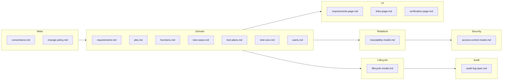

# Documentation Index

## Purpose

This folder contains the specification documents for the aerospace lifecycle management tool. The docs define domain entities, traceability, lifecycle, security, audit, UI behavior, and conventions. Conformance supports schema design, API contracts, and AI-driven codebase updates.

---

## Documentation Structure

---

## Categories and Files

| Category | Description | Files |
|----------|-------------|-------|
| **meta** | Conventions and change policy for all specs. | [meta/conventions.md](meta/conventions.md), [meta/change-policy.md](meta/change-policy.md) |
| **domain** | Entity specifications: attributes, enums, relationships. | [domain/requirements.md](domain/requirements.md), [domain/pbs.md](domain/pbs.md), [domain/functions.md](domain/functions.md), [domain/test-cases.md](domain/test-cases.md), [domain/test-plans.md](domain/test-plans.md), [domain/test-runs.md](domain/test-runs.md), [domain/users.md](domain/users.md) |
| **lifecycle** | State machines and allowed transitions. | [lifecycle/lifecycle-model.md](lifecycle/lifecycle-model.md) |
| **relations** | Traceability and structural relations, cardinality, cascade. | [relations/traceability-model.md](relations/traceability-model.md) |
| **security** | RBAC: roles, permissions, resources. | [security/access-control-model.md](security/access-control-model.md) |
| **audit** | Audit log events, payload, retention. | [audit/audit-log-spec.md](audit/audit-log-spec.md) |
| **ui** | UI behavior and layout for key pages. | [ui/requirements-page.md](ui/requirements-page.md), [ui/links-page.md](ui/links-page.md), [ui/verification-page.md](ui/verification-page.md) |
| **architecture** | System context and container overview. | [architecture/architecture-overview.md](architecture/architecture-overview.md) |
| **diagrams** | Domain model and entity-relationship view. | [diagrams/domain-model.md](diagrams/domain-model.md) |
| **workflows** | User workflows (requirement to verified, lifecycle, links). | [workflows/user-workflows.md](workflows/user-workflows.md) |
| **api** | REST resource map and base paths. | [api/api-overview.md](api/api-overview.md) |
| **glossary** | Term definitions. | [glossary.md](glossary.md) |
| **root** | Linkage and requirements-lifecycle analysis. | [linkage-requirements-v1.md](linkage-requirements-v1.md), [requirements-linkage-lifecycle-v1.md](requirements-linkage-lifecycle-v1.md), [LINKS_ANALYSIS.md](LINKS_ANALYSIS.md) |

---

## Where to Start

1. **New to the specs:** Read [meta/conventions.md](meta/conventions.md) for structure and language rules.
2. **Domain model:** Read [domain/requirements.md](domain/requirements.md) and [domain/pbs.md](domain/pbs.md), then [relations/traceability-model.md](relations/traceability-model.md).
3. **Lifecycle and status:** Read [lifecycle/lifecycle-model.md](lifecycle/lifecycle-model.md).
4. **Permissions and audit:** Read [security/access-control-model.md](security/access-control-model.md) and [audit/audit-log-spec.md](audit/audit-log-spec.md).
5. **UI behavior:** Read [ui/requirements-page.md](ui/requirements-page.md), [ui/links-page.md](ui/links-page.md), [ui/verification-page.md](ui/verification-page.md).
6. **Architecture and API:** Read [architecture/architecture-overview.md](architecture/architecture-overview.md) and [api/api-overview.md](api/api-overview.md).
7. **Diagrams and workflows:** Read [diagrams/domain-model.md](diagrams/domain-model.md), [workflows/user-workflows.md](workflows/user-workflows.md), and [glossary.md](glossary.md).
