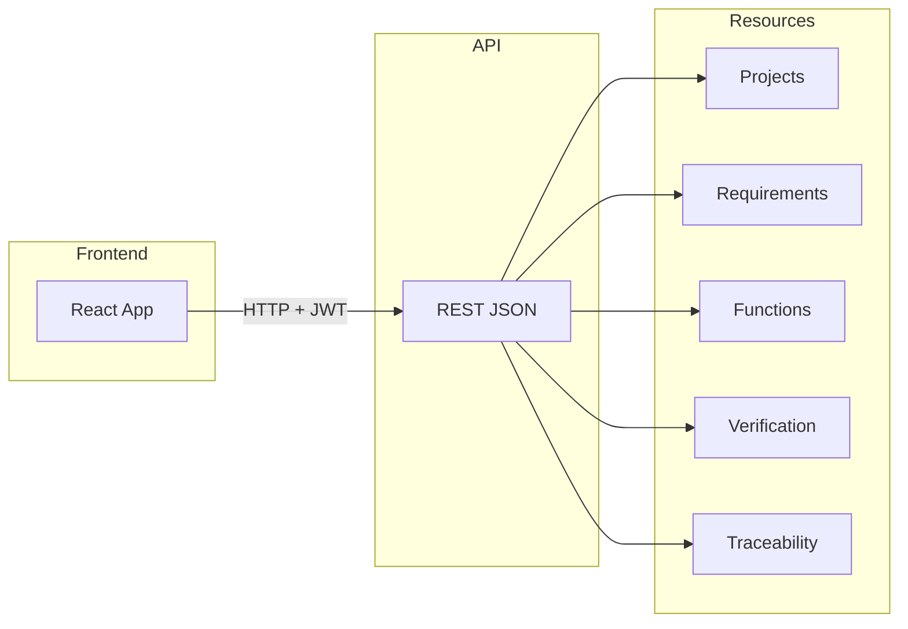

# API Overview

## Purpose

This document maps the main REST resources and endpoints for the aerospace lifecycle management tool. It supports frontend–backend alignment and onboarding. Payload semantics align with the domain entity specs; permissions align with [../security/access-control-model.md](../security/access-control-model.md). No environment or infrastructure details are specified here.

---

## Base URL and Auth

- **Base path:** All API routes are mounted under `/api/v1`.
- **Authentication:** JWT. Requests SHALL include a valid token (e.g. `Authorization: Bearer <token>`). Auth endpoints (login, register) are under `/api/v1/auth`.
- **Health:** `GET /api/health`, `GET /api/health/db` (and optionally `GET /api/v1` for endpoint list).

---

## Resource Map

| Resource | Base path | Main actions | Notes |
|----------|-----------|--------------|-------|
| **Auth** | `/api/v1/auth` | Login, register, refresh, logout | See backend auth routes. |
| **Projects** | `/api/v1/projects` | Create, list, get, update, delete; members, invitations, audit-logs, analytics | Project = top-level scope; components (PBS) are under projects. |
| **Components (PBS)** | `/api/v1/projects` (e.g. project tree/components) | List, create, update, delete PBS nodes | Scoped by project. |
| **Requirements** | `/api/v1/requirements` | List/get/create/update/delete per project; `/:projectId/:requirementId`; parent, children, subscription, comments, bulk-update, bulk-import, restore, component | Scoped by `:projectId`. |
| **Functions** | `/api/v1/functions` | List, get, create, update, delete, move, component; `/:projectId`, `/:projectId/:id` | Scoped by `:projectId`. |
| **Verification (test cases, plans, runs)** | `/api/v1/verification` | Test cases: `GET/POST/PATCH/DELETE /test-cases/:projectId`, links, review, approve. Test plans: `GET/POST/PATCH/DELETE /test-plans/:projectId`, add/remove-case, approve, close. Test runs/results, evidence, coverage, MOC, methods, setups | See backend verification.routes for full list. |
| **Traceability** | `/api/v1/traceability` | `GET /:projectId` (links), `GET /:projectId/graph`, suspect links; create/delete links per backend | Filter by sourceId, targetId, sourceType, targetType. |
| **Relations** | `/api/v1/relations` | Relation-specific endpoints per backend | Link management (verifies, satisfies, derives-from). |
| **Lifecycle** | `/api/v1/lifecycle` | Library, applicable, transitions; control-tower overview/trends | Status transitions may be via PATCH on entity (e.g. requirement status) or dedicated transition endpoint. |
| **Other** | Various | Architecture, issues, parameters, definitions, change-requests, views, versions, baselines, usecases, templates, reqif, diagrams, tags, attachments, search, workflow, notifications, admin, organization, etc. | See backend `routes/index.ts` for full mount list. |

---

## Frontend–Backend–Resources (Diagram)

---

## Domain Entity and Permission References

- **Payload and attributes:** See [../domain/requirements.md](../domain/requirements.md), [../domain/pbs.md](../domain/pbs.md), [../domain/functions.md](../domain/functions.md), [../domain/test-cases.md](../domain/test-cases.md), [../domain/test-plans.md](../domain/test-plans.md), [../domain/test-runs.md](../domain/test-runs.md), [../domain/users.md](../domain/users.md).
- **Permissions:** Resource and action (e.g. `requirement.create`, `test_case.read`) are defined in [../security/access-control-model.md](../security/access-control-model.md). Backend SHALL enforce RBAC per role.

---

## Change Impact Notes

- When backend adds or removes routes or changes base paths, update the resource map and any referenced paths. Document only; no code or env changes in this repo.
