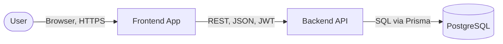
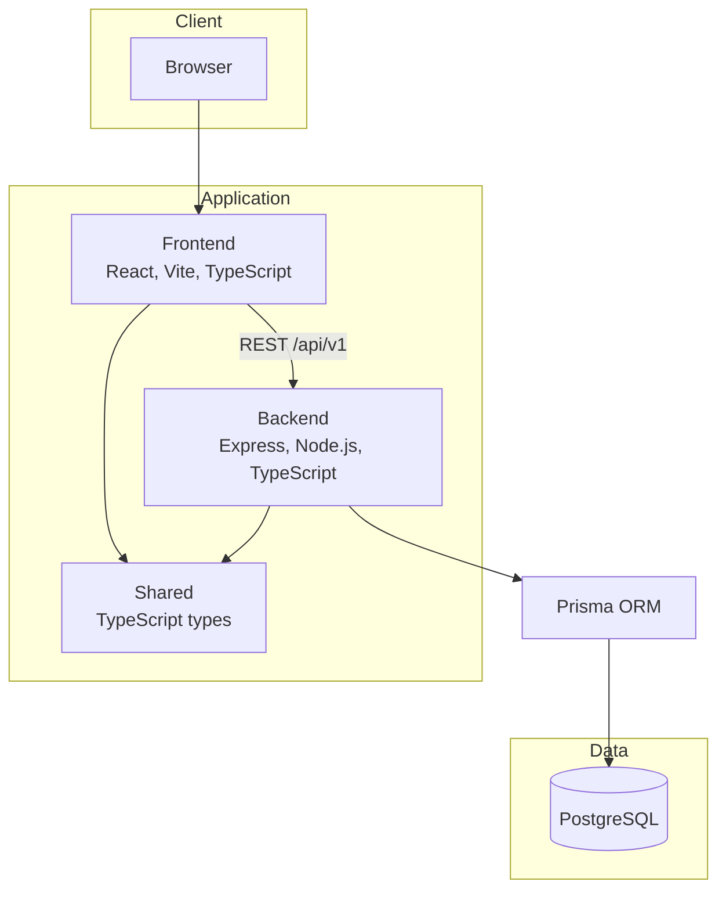

# Architecture Overview

## Purpose

This document describes the system context and high-level building blocks of the aerospace lifecycle management tool (frontend, backend, database, users) for implementers and maintainers. It does not define environment, Docker, or database schema; those remain under infrastructure lock.

---

## System Context

- **User:** Interacts with the application via a web browser (authenticated).
- **Frontend App:** React single-page application. Sends REST requests to the backend; uses JWT for auth.
- **Backend API:** Node.js/Express server. Handles auth, business logic, and persistence. Exposes JSON API under `/api/v1`.
- **PostgreSQL:** Relational database. All domain data (requirements, PBS, functions, test cases, test plans, test runs, users, traceability, audit) is stored here. Access is through Prisma ORM.

---

## Container Diagram

- **Frontend:** React 18, Vite, TypeScript. State: Zustand; server state: React Query. Routing: React Router. Styling: Tailwind CSS. Consumes shared types from `shared/`.
- **Backend:** Express on Node.js, TypeScript. Auth: JWT (middleware). Persistence: Prisma. Mounts routes at `/api/v1` (see [../api/api-overview.md](../api/api-overview.md)).
- **Shared:** TypeScript types and contracts used by both frontend and backend (e.g. entity shapes, DTOs). No runtime dependency on React or Express.
- **PostgreSQL:** Single database. Schema and migrations are managed via Prisma; domain entities and relations align with [../domain/](../domain/) and [../relations/traceability-model.md](../relations/traceability-model.md).

---

## What the System Manages

The application manages **requirements**, **PBS** (product breakdown structure), **functions**, **test cases**, **test plans**, **test runs**, **users**, and **traceability** between them (verifies, derives-from, satisfies). Lifecycle states and transitions are defined in [../lifecycle/lifecycle-model.md](../lifecycle/lifecycle-model.md). Access control is RBAC; see [../security/access-control-model.md](../security/access-control-model.md). Audit events are described in [../audit/audit-log-spec.md](../audit/audit-log-spec.md).

---

## Change Impact Notes

- Documenting existing architecture only. No infrastructure or port changes.
- If new components or ports are added, update the diagrams and prose accordingly.
