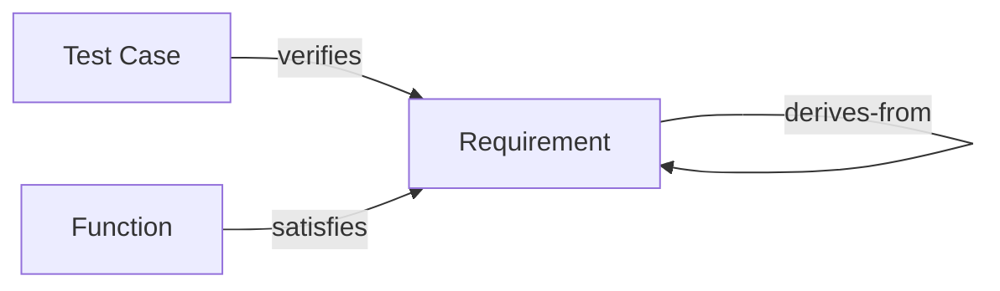

# Glossary

## Purpose

Single place for term definitions used across the specification documents. Definitions support readers and machine-assisted updates. See also the domain entity specs and [relations/traceability-model.md](relations/traceability-model.md).

---

## Traceability Concept Map

---

## Terms (Alphabetical)

| Term | Definition | See also |
|------|------------|----------|
| **audit log** | Immutable record of events (entity create/update/delete, lifecycle transitions, link changes, login). Each record SHALL include actor, timestamp, entity type, action, and optional payload. | [audit/audit-log-spec.md](audit/audit-log-spec.md) |
| **derives-from** | Traceability relation from a child requirement to a parent requirement. The child requirement derives-from exactly zero or one parent; the graph SHALL be acyclic. | [domain/requirements.md](domain/requirements.md), [relations/traceability-model.md](relations/traceability-model.md) |
| **entity** | A domain object with an id and attributes (e.g. Requirement, Test Case, PBS, Function, User). Entity types are the resources in the access-control model. | [domain/](domain/), [security/access-control-model.md](security/access-control-model.md) |
| **Function** | A system function that satisfies one or more requirements. Scoped to a PBS node (project_id); may have a parent function. Has lifecycle status (draft, under_review, approved, obsolete). | [domain/functions.md](domain/functions.md) |
| **lifecycle** | The set of states and allowed transitions for an entity (e.g. Requirement: draft → under_review → approved → implemented → verified; obsolete). Transitions are deterministic and permission-aware. | [lifecycle/lifecycle-model.md](lifecycle/lifecycle-model.md) |
| **PBS** | Product Breakdown Structure. Hierarchical decomposition of the product or project into nodes (e.g. project, subsystem, work package). Requirements, test cases, test plans, and functions are scoped to a PBS node via project_id. | [domain/pbs.md](domain/pbs.md) |
| **project_id** | Foreign key on domain entities (Requirement, Test Case, Test Plan, Function) that scopes the entity to one PBS node. Often referred to as "project" or "scope" in the UI. | [domain/pbs.md](domain/pbs.md), [relations/traceability-model.md](relations/traceability-model.md) |
| **Requirement** | A formal statement of a capability, constraint, or condition the system SHALL satisfy. Uniquely identified by code within project; has type, priority, status; may derive-from a parent requirement and be verified by test cases. | [domain/requirements.md](domain/requirements.md) |
| **RBAC** | Role-Based Access Control. Permissions are (resource, action); roles aggregate permissions; users are assigned roles. Access to entities and actions (create, read, update, delete, transition, link) is determined by the user's roles. | [security/access-control-model.md](security/access-control-model.md) |
| **satisfies** | Traceability relation from a function to one or more requirements. A function satisfies at least one requirement. | [domain/functions.md](domain/functions.md), [relations/traceability-model.md](relations/traceability-model.md) |
| **status** | The current lifecycle state of an entity (e.g. RequirementStatus: draft, under_review, approved, implemented, verified, obsolete). Stored as an enum on the entity; transitions are defined in the lifecycle model. | [lifecycle/lifecycle-model.md](lifecycle/lifecycle-model.md) |
| **Test Case** | A specification of inputs, preconditions, steps, and expected results used to verify one or more requirements. Scoped to a PBS node; linked to requirements via verifies; executed as test runs. | [domain/test-cases.md](domain/test-cases.md) |
| **Test Plan** | A collection of test cases (many-to-many). Scoped to a PBS node. Has status (draft, locked, closed). Test runs may be associated with a test plan. | [domain/test-plans.md](domain/test-plans.md) |
| **Test Run** | A single execution of a test case. Records result, optional link to a test plan, optional executor (user). Immutable after finalization (configurable). | [domain/test-runs.md](domain/test-runs.md) |
| **traceability** | The set of allowed relations between entities: verifies (Test Case → Requirement), derives-from (Requirement → Requirement), satisfies (Function → Requirement), plus structural relations (part-of, parent, contains, executed-in, executes_plan). | [relations/traceability-model.md](relations/traceability-model.md) |
| **verifies** | Traceability relation from a test case to one or more requirements. A test case verifies at least one requirement. Verification evidence is recorded via test runs. | [domain/test-cases.md](domain/test-cases.md), [relations/traceability-model.md](relations/traceability-model.md) |

---

## Change Impact Notes

- Adding or changing a term: update this table and optional concept map. Ensure definitions stay aligned with domain and relations specs.
