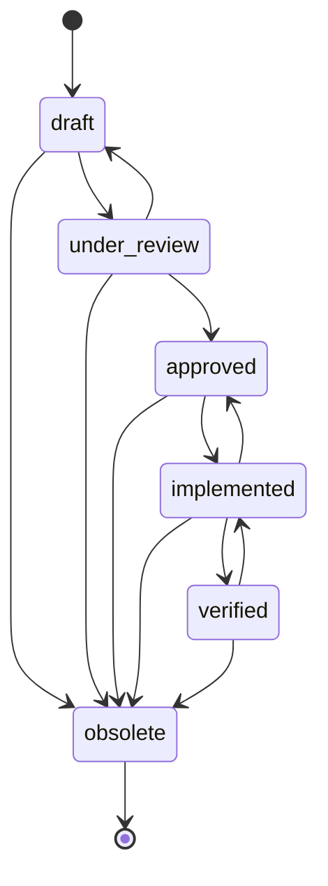
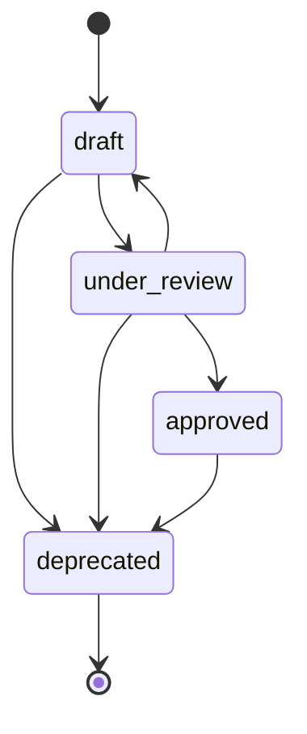
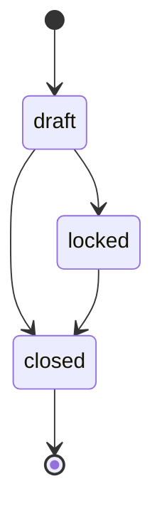
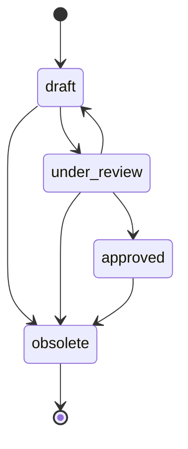

# Lifecycle Model

## Overview

This document defines the lifecycle (state) models for entities that have a status or state machine. Transitions are deterministic. Each state is an enum value on the entity; transition rules and permissions are defined here for backend and UI.

---

## Requirement Lifecycle

### States (RequirementStatus)

| State | Description |
|-------|-------------|
| draft | Work in progress; not yet approved. |
| under_review | Submitted for review. |
| approved | Approved for implementation and verification. |
| implemented | Implementation complete. |
| verified | Verification evidence linked and accepted. |
| obsolete | No longer applicable; retained for history. |

### Allowed Transitions

| From | To | Condition / Note |
|------|-----|------------------|
| draft | under_review | Allowed. |
| draft | obsolete | Allowed. |
| under_review | draft | Allowed (withdraw). |
| under_review | approved | Allowed. |
| under_review | obsolete | Allowed. |
| approved | implemented | Allowed. |
| approved | obsolete | Allowed. |
| implemented | verified | Allowed. |
| implemented | approved | Optional (rework). |
| implemented | obsolete | Allowed. |
| verified | obsolete | Allowed. |
| verified | implemented | Optional (re-verify). |
| obsolete | — | No transition out of obsolete. |

All other transitions are **forbidden** (e.g. approved → draft unless under_review → draft).

### State Diagram (Requirement)

### Validation by State

- **approved**: MAY require at least one verifies link (test case) per policy; configurable.
- **verified**: MAY require at least one passing test run per linked test case per policy; configurable.

---

## Test Case Lifecycle

### States (TestCaseStatus)

| State | Description |
|-------|-------------|
| draft | Work in progress. |
| under_review | Submitted for review. |
| approved | Approved for execution. |
| deprecated | No longer executed; retained for history. |

### Allowed Transitions

| From | To | Condition / Note |
|------|-----|------------------|
| draft | under_review | Allowed. |
| draft | deprecated | Allowed. |
| under_review | draft | Allowed. |
| under_review | approved | Allowed. |
| under_review | deprecated | Allowed. |
| approved | deprecated | Allowed. |
| deprecated | — | No transition out. |

### State Diagram (Test Case)

### Validation by State

- **approved**: MAY require at least one requirement (verifies) per policy.

---

## Test Plan Lifecycle

### States (TestPlanStatus)

| State | Description |
|-------|-------------|
| draft | Test cases can be added/removed. |
| locked | Content frozen; ready for execution. |
| closed | No longer active; historical. |

### Allowed Transitions

| From | To | Condition / Note |
|------|-----|------------------|
| draft | locked | Allowed. |
| draft | closed | Allowed. |
| locked | closed | Allowed. |
| closed | — | No transition out. |

### State Diagram (Test Plan)

### Behavior by State

- **draft**: Add/remove test cases allowed.
- **locked**: Add/remove test cases MAY be forbidden (configurable). Test runs can be recorded against plan.
- **closed**: Read-only for content; no new runs or optional.

---

## Function Lifecycle

### States (FunctionStatus)

| State | Description |
|-------|-------------|
| draft | Work in progress. |
| under_review | Submitted for review. |
| approved | Approved; linked requirements satisfied. |
| obsolete | No longer applicable; retained for history. |

### Allowed Transitions

| From | To | Condition / Note |
|------|-----|------------------|
| draft | under_review | Allowed. |
| draft | obsolete | Allowed. |
| under_review | draft | Allowed. |
| under_review | approved | Allowed. |
| under_review | obsolete | Allowed. |
| approved | obsolete | Allowed. |
| obsolete | — | No transition out. |

### State Diagram (Function)

---

## PBS

No formal lifecycle states in this specification. Use active/deleted flag if needed; see domain/pbs.md.

---

## Test Run

No state machine. Record is created with result and is immutable after finalization (configurable). See domain/test-runs.md.

---

## Implementation Notes

- **State field**: One attribute per entity (e.g. `status`) of type enum. Store only current state.
- **Transition API**: POST `/api/requirements/:id/transition` with body `{ "to": "approved" }` or PATCH with `status: "approved"`. Server SHALL validate transition and return 400 if forbidden.
- **Permissions**: Role may be required for specific transitions (e.g. only Reviewer can approve). See access-control-model.md.
- **Audit**: Every state change SHALL be logged (entity, id, previous_status, new_status, user, timestamp). See audit-log-spec.md.

---

## Change Impact Notes

- Adding a state: Add enum value and new transition rows; update UI and API. `[CHANGE_ENUM]`.
- Removing a state: Breaking; migrate existing entities to another state first. `[CHANGE_ENUM]`.
- Adding/removing a transition: Update this table and backend transition validator. No schema change.
- `[CHANGE_VALIDATION]` Changing validation by state (e.g. approved requires verifies): Update validation rules and API.
