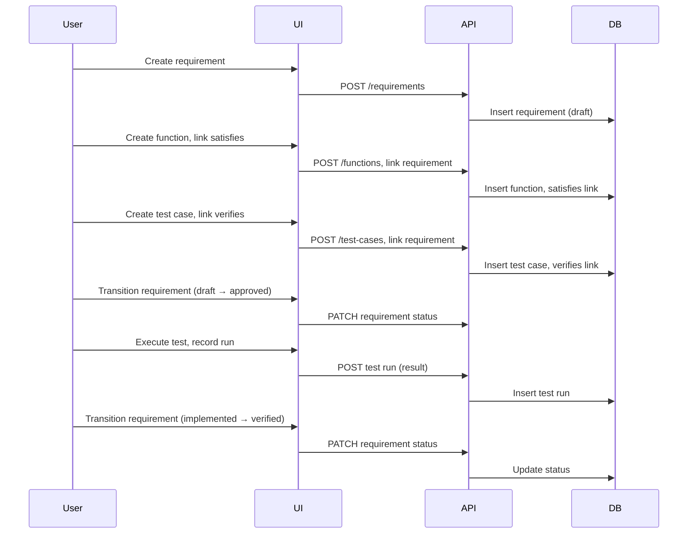
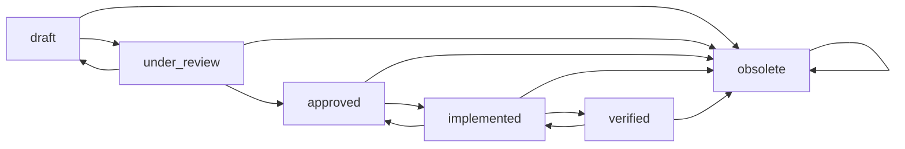
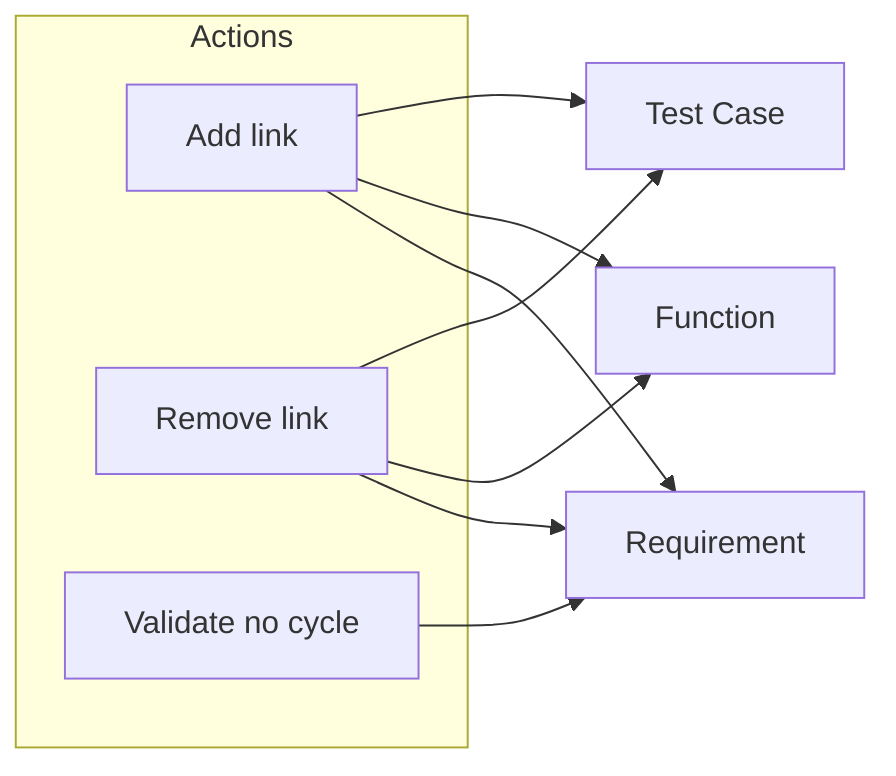

# User Workflows

## Purpose

This document describes the main end-to-end user flows: from requirement to verified requirement, requirement lifecycle, and link management. It gives product and development a shared view of intended usage. Normative rules remain in [../lifecycle/lifecycle-model.md](../lifecycle/lifecycle-model.md), [../relations/traceability-model.md](../relations/traceability-model.md), and the UI specs.

---

## From Requirement to Verified

High-level flow: create requirement → optionally derive/link → create function (satisfies) → create test case (verifies) → run test → record result → transition requirement to verified.

### Steps (Summary)

1. **Create requirement** in project (PBS scope). Set code, title, description, type, priority. See [../ui/requirements-page.md](../ui/requirements-page.md).
2. **Optionally set parent:** Link requirement to a parent (derives-from) on requirement detail or links page. See [../ui/links-page.md](../ui/links-page.md).
3. **Create function** in same project; add satisfies links to one or more requirements. See [../domain/functions.md](../domain/functions.md).
4. **Create test case** in same project; add verifies links to one or more requirements. See [../ui/verification-page.md](../ui/verification-page.md).
5. **Transition requirement** through lifecycle as needed: draft → under_review → approved (see [../lifecycle/lifecycle-model.md](../lifecycle/lifecycle-model.md)).
6. **Execute test:** Record a test run for the test case (result: pass/fail/etc.). See [../domain/test-runs.md](../domain/test-runs.md).
7. **Transition requirement to verified** when verification evidence is accepted (implemented → verified). Optional policy: verified may require at least one passing test run per linked test case.

---

## Requirement Lifecycle (Flow)

Allowed transitions; normative table is in [../lifecycle/lifecycle-model.md](../lifecycle/lifecycle-model.md).

- **Main path:** draft → under_review → approved → implemented → verified.
- **Exit path:** obsolete from draft, under_review, approved, implemented, or verified; no transition out of obsolete.
- **Optional back:** implemented → approved (rework); verified → implemented (re-verify).

---

## Link Management Flow

Managing traceability links: derives-from (Requirement → Requirement), satisfies (Function → Requirement), verifies (Test Case → Requirement).

- **Derives-from:** On requirement detail or links page: select parent requirement or clear. System SHALL validate that the graph remains acyclic (no R1 → R2 → R1). See [../ui/links-page.md](../ui/links-page.md).
- **Satisfies:** On function detail: add/remove requirements that this function satisfies. Function MUST satisfy at least one requirement per [../relations/traceability-model.md](../relations/traceability-model.md).
- **Verifies:** On test case detail or requirement detail: add/remove verifies links. Test case MUST verify at least one requirement.

---

## Change Impact Notes

- Workflow steps and diagrams are descriptive. If lifecycle transitions or relation rules change in lifecycle-model or traceability-model, update this document to match.
