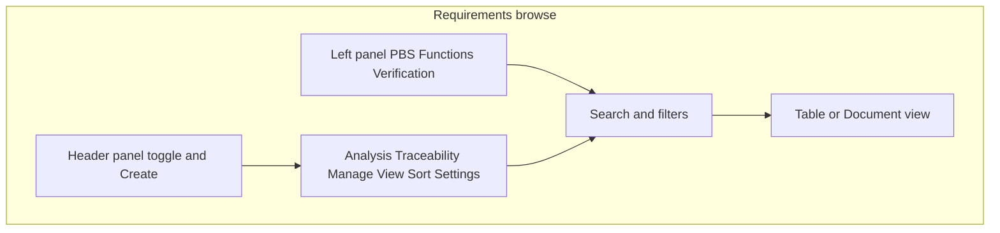

# User handbook: Requirements (browse)

This handbook describes the **Requirements browse** screen: the main workspace where you create, search, filter, and trace requirements for a project. It follows the same section order used across product handbooks so you can compare areas consistently.

**Figures:** Screenshots live under `guidelines/assets/requirements/` (see [Capturing screenshots](#capturing-screenshots)). If an image is missing, run the screenshot job described there or capture manually.

---

## 1. Purpose & audience

The Requirements browse page is where you **work with the live requirement set** for a project: scan and filter the list, open the detail drawer or modals, edit inline in the table, manage traceability links, run analysis tools, and import or export data. Use it when you need to **author, review, allocate, verify, or govern** requirements together with PBS components, system functions, and verification artifacts.

| Role | Typical use |
|------|-------------|
| Requirements engineer | Create and maintain requirements, hierarchy, and metadata |
| Systems engineer | Allocate to PBS/functions, review traceability |
| Verification engineer | Scope by verification tree, link tests, review coverage |
| Project lead / approver | Approve lifecycle transitions, baselines, quality |
| Reviewer | Read requirements, comments, suspect links |

---

## 2. How to open this screen

**Canonical route:** `/projects/:projectId/requirements/browse`

**Shortcut:** `/projects/:projectId/requirements` (no `browse`) **redirects** to `.../requirements/browse` and **keeps the query string** (so bookmarks to the short path still work).

**Example (local development):** `http://localhost:3000/projects/<your-project-id>/requirements/browse`

### Query parameters

The app keeps **shareable** filters and scope in the URL when you are **not** viewing a baseline snapshot.

| Parameter | Purpose |
|-----------|---------|
| `panel` | `1` = left panel open. Omitted or absent = panel closed (unless `openPanel` is used). |
| `openPanel` | `1` = open the left panel **once**, then removed from the URL (one-shot). |
| `panelTab` | Active left panel mode: `pbs`, `functions`, or `verification`. Omit when `pbs` (default). |
| `tree` | Legacy alias read on load; **synced state prefers `panelTab`** and the app removes `tree` when syncing. |
| `layout` | `table` (default) or `document` for the main list. |
| `componentId` | PBS component selected in the left panel (filters the list). |
| `functionId` | Function selected in the left panel (filters the list). |
| `testCaseId` | Verification test case selected (implies verification panel). |
| `testPlanId` | Verification test plan selected. |
| `linkToCase` | Test case id for deep-link parity (selects that case in verification). |
| `noTestCaseVerifiesLink` | `1` or `true` selects the **“no test case verifies”** scope in verification. |
| `reviewStatus` | `all` or a specific review status (see filter row). |
| `verificationStatus` | `all` or a specific verification status filter. |
| `requirementId` | Opens/focuses the **detail drawer** for that requirement. |
| `focusRequirementId` | Legacy; merged into `requirementId` when present. |
| `focusType` + `focusId` | Legacy; merged into `requirementId` when `focusType` is `requirement`. |
| `baselineId` | **Baseline snapshot mode:** read-only list for that baseline (see below). |
| `openBaselines` | `1` opens the **Baselines** manager from a link. |
| `openSuspect` | `1` opens **Suspect link review** once, then clears from URL. |
| `qualityWorkbench` | `1` opens **Requirement quality** once, then clears from URL. |

**Baseline mode:** With `baselineId` set, the page shows a **baseline banner** (“Viewing baseline: … — Editing is disabled”). URL sync for panel, scope, and filters is **not** the same as live mode; use **Exit baseline view** to return to the browse URL without `baselineId`.

### Figure: Overview


---

## 3. Layout map

1. **Top bar (within the page)** — Toggle **left panel** (Structure & Verification), **Requirements** heading, **count** (filtered vs total when filters or scope apply), and **Create Requirement** (disabled in baseline view).
2. **Toolbar row** — **Analysis**, **Traceability**, **Manage** (import/export/baselines/audit), **View** (layout, density, columns, diagram), **Sort** (pill), **Settings** (requirements settings), **Create Requirement** (duplicate of primary action on small screens).
3. **Search** — Single field for broad text search (see section 6).
4. **Filter row** — Status, priority, type, **More Filters** / **Fewer Filters**, **Clear all**, and optional **Scope** chip when the left panel filters the list.
5. **Bulk selection banner** — Appears when rows are selected (live mode only): **Bulk Actions** menu.
6. **Main content** — **Table** or **Document** view (grouping optional, pagination, expandable hierarchy in table).
7. **Left panel** (when open) — Dropdown **PBS / Functions / Verification**, tree content, **resize handle** on the right edge.
8. **Overlays** — Detail drawer, create/edit/delete modals, trace matrix, function verification matrix, suspect review, quality panel, baselines, import/export, audit log, relationship diagrams.



---

## 4. Core workflows

### 4.1 Create a requirement

**Goal:** Add a new requirement to the project.

1. Click **Create Requirement** (top right or toolbar).
2. Fill **Title** (required) and optional **Description**, **Parent**, **PBS / function** allocation, and other fields in the modal.
3. Click **Save**.

**Result:** The new row appears in the list; the **ID** is assigned by the system.

### 4.2 Find and filter requirements

**Goal:** Narrow the list to the requirements you care about.

1. Type in the **Search** bar. The placeholder describes the scope: title, description, ID, requirement type, owner, tags, criteria, and related fields.
2. Use **Sort:** (pill) to pick a sortable column and toggle ascending/descending.
3. Use **Status**, **Priority**, and **Type** pills, or **More Filters** for category, owner, source, verification status, and review status.
4. When the **left panel** applies scope, a **Scope** chip appears; click **×** on it to clear only scope, or **Clear all** to reset every filter including scope.

**Result:** The count next to the heading shows **filtered of total** when filters or scope are active.

### 4.3 Open the detail drawer

**Goal:** Read full details and use linked items.

1. Click a requirement **Title** in the table (single click opens after a short delay so double-click can start inline edit).
2. Use **Overview**, **Hierarchy**, **Links**, **Reviews**, **Lifecycle & Approvals** (when enabled), and **Comments** tabs in the drawer.

**Result:** Deep links can include `requirementId=…` in the URL for sharing.

### 4.4 Edit (modal vs inline)

**Goal:** Change fields quickly or in full form.

**Modal:** Use **Edit** on the row or in the drawer.

**Inline:** **Double-click** an editable cell (e.g. title, description, priority, status, owner). Where the row is **locked** (baseline or lifecycle), inline edit and some actions are disabled.

**Result:** Changes save; validation errors appear in the modal or inline.

### 4.5 Select rows and bulk actions

**Goal:** Act on several requirements at once.

1. Select rows with the **checkbox** column.
2. Use **Bulk Actions** on the **banner:** **Create Change Request(s)**, **Create Issue(s)**, or **Delete Selected** (confirmations apply).

**Result:** Bulk operations run against the selection; **Delete** respects locks and may warn.

### 4.6 Allocate to a function (Functions panel)

**Goal:** Link requirements to a system function.

1. Open the **Functions** tab in the left panel and select a function.
2. **Drag** rows from the table onto the function **drop target** in the tree, or use the tree’s **add** actions where applicable.

**Result:** Allocations update; the list can be filtered by scope to that function.

### 4.7 Work with a baseline snapshot

**Goal:** Review a frozen requirement set.

1. Open **Manage → Baselines** (or arrive via a link with `baselineId`).
2. Choose a baseline to view.

**Result:** A **banner** shows the baseline name; **editing**, **import**, **traceability matrix**, and many tree actions are **disabled**. Click **Exit baseline view** to return to live data.

### Figure: Filters and scope


---

## 5. Left panel modes (PBS, Functions, Verification)

Use the **dropdown** at the top of the left panel to switch modes. **Resize** the panel by dragging the vertical handle on the right edge. **Collapse** the panel with the **panel** icon on the left of the page title.

### 5.1 PBS

Shows the **Product Breakdown Structure** tree. Selecting a **component** filters the main list to requirements associated with that component (server-side scope). The URL includes `componentId` when not in baseline mode.

### 5.2 Functions

Shows the **system function** hierarchy. Selecting a **function** filters the list to requirements allocated to that function (`functionId` in the URL). You can **drag** requirement rows onto the tree to allocate.

### 5.3 Verification

Shows **test plans**, **cases**, and related verification structure. Selecting a **test case** or **test plan** (or the special **no test case verifies** scope) filters requirements accordingly. Actions may include **opening the Verification** module for a focused node, **export** scoped to a plan/test case, **removing** links, or **dropping** requirements onto test cases—**disabled in baseline view**.

### Figure: Left panel


---

## 6. Main list: search, filters, columns, and bulk actions

### Search

- **Debounced** input (typing pauses briefly before the query runs).
- Tooltip on the field: **“Search all fields (title, description, ID, requirement type, owner, tags, criteria…)”** — use this as the authoritative description of search coverage.

### Filters

| Primary row | Values |
|-------------|--------|
| Status | All, or project-specific statuses |
| Priority | All, Low, Medium, High, Critical |
| Type | All, Functional, Performance, Interface, Design Constraint, Safety, Security, Usability, Other |

**More Filters** expands: **Category**, **Owner**, **Source**, **Verification** (Not Verified / Verified / Failed), **Review** (Draft / Under Review / Approved / Rejected).

### Sort

**Sort:** pill shows the current column label (default **Created** with **descending**). Open the menu to pick any **sortable** column from the field catalog; click again to flip direction.

### Pagination

**50** requirements per page (fixed page size in the app).

### Table vs document

- **View → Table View** or **Document View** toggles layout. **Document** view can show an **outline** (preference persisted). **Group by Type** groups rows under requirement types when enabled.
- **Comfortable** / **Compact** density affects spacing and some default collapses in document view.

### Columns

**View → Columns** opens the picker. **Select all**, **Select none**, **Reset**, and **search** within field names. Column widths are **resizable**; visibility and widths persist (local + server preferences for the project where implemented).

### Selection

Row checkboxes drive the **bulk** banner. **Bulk Actions** is **hidden** in baseline snapshot mode.

### Figure: View menu and columns


---

## 7. Requirement detail, editing, and locks

### Detail drawer tabs

| Tab | Content |
|-----|---------|
| **Overview** | IDs, description (rich text), lifecycle, priority, status, owner, source, acceptance criteria, MoC, verification method, classification, KPP, rationale, assumptions, etc. |
| **Hierarchy** | Parent/child relationships |
| **Links** | Traceability links and link management |
| **Reviews** | Review records |
| **Lifecycle & Approvals** | Lifecycle transitions when enabled |
| **Comments** | Threaded comments (count in tab label) |

Header actions typically include **Edit**, **Delete** (when allowed), **Create Link**, **close**. **Locked** requirements show disabled controls and tooltips.

### Baseline and locks

- **Baseline snapshot:** read-only in the drawer and list.
- **Lifecycle locks:** rows may show a lock; editing is blocked until the lock rule is satisfied.

---

## 8. Traceability, links, and graphs

### Toolbar menus

| Menu | Item | Notes |
|------|------|------|
| **Traceability** | **Traceability Matrix** | Full-screen matrix overlay; **disabled in baseline view** with tooltip. |
| **Traceability** | **Matrix library** | Navigates to `/projects/:projectId/requirements/traceability` (saved matrix views). |
| **View** | **Relationship diagram** | Opens the relationship diagram modal for the project. |

### Suspect links

**Analysis → Suspect link review** opens the review workflow for links that may be stale.

### Creating links

From the **detail drawer** (or row actions where available), use **Create Link** and choose type and target. Removing links in the **Verification** tree is disabled in baseline view.

### Figure: Traceability menu


---

## 9. Import, export, and baselines

All entry points are under **Manage** (toolbar).

| Item | Role |
|------|------|
| **Import** | Import wizard (disabled in baseline view). |
| **Export** | Export builder; can be scoped with a preset from the verification tree (plan/test case). |
| **Baselines** | Create, compare, and open baseline snapshots (`baselineId` links). |
| **Audit log** | Audit trail for requirements activity. |

**Baseline manager** can also open via `openBaselines=1` in the URL.

### Figure: Manage menu


---

## 10. Analysis and quality

| Menu | Item | Role |
|------|------|------|
| **Analysis** | **Requirement quality** | Quality metrics and drill-down (also open via `qualityWorkbench=1`). |
| **Analysis** | **Function verification** | Function vs verification coverage matrix overlay. |
| **Analysis** | **Suspect link review** | Review suspect links (also open via `openSuspect=1`). |

---

## 11. Permissions and collaboration

- **Project and role** permissions control who can create, edit, delete, import, and manage baselines. Exact roles depend on your organization’s configuration.
- **Concurrent editing:** last save wins unless the API enforces optimistic locking (you may see a message to refresh).
- **Comments and reviews** on the drawer support collaboration without leaving the page.

---

## 12. Troubleshooting and limits

| Issue | What to try |
|-------|-------------|
| List empty | Clear **Scope** and **Clear all** filters; check search text. |
| Cannot edit | **Exit baseline view**; check for **lock** icon or lifecycle state. |
| Traceability matrix disabled | You are in **baseline snapshot** mode — return to live. |
| Left panel wrong scope | Switch **panelTab** / select a node again; clear `componentId`/`functionId` via URL or clear scope. |
| Import fails | Check file format in the wizard; verify permissions. |

---

## 13. Glossary

| Term | Definition |
|------|------------|
| **PBS** | Product Breakdown Structure — component hierarchy used for allocation. |
| **Baseline** | Named snapshot of requirements; viewing with `baselineId` is read-only. |
| **Suspect link** | Traceability link flagged for review when linked artifacts change. |
| **Allocation** | Assigning a requirement to a PBS component or system function. |
| **Verification status** | Whether a requirement has been verified (filter uses Not Verified / Verified / Failed). |
| **Scope** | Filter applied by the left panel selection (shown as a **Scope** chip). |
| **Matrix library** | Saved traceability matrix views on the traceability route. |

---

## 14. Related pages

| Path | Page |
|------|------|
| `/projects/:projectId/requirements/dashboard` | Requirements dashboard |
| `/projects/:projectId/requirements/settings` | Requirements settings |
| `/projects/:projectId/requirements/traceability` | Matrix library (saved views) |
| `/projects/:projectId/product-breakdown-structure` | PBS editor |
| `/projects/:projectId/functions` | System functions |
| `/projects/:projectId/verification` | Verification module |
| `/projects/:projectId/parameters` | Parameters |

---

## Document control

| Field | Value |
|-------|--------|
| Page / module | Requirements — browse |
| Last reviewed | 2026-04-18 |
| Applies to product version | As of current `dev` branch |
| Owner | Product / documentation |

---

## Capturing screenshots

Screenshots are generated into `guidelines/assets/requirements/` by the Playwright test **when the app and API are running** (same as other E2E tests). Configure E2E credentials per `frontend/e2e/helpers/auth.ts` (`E2E_USERNAME` / `E2E_PASSWORD` or `frontend/e2e/.auth/creds.json`).

From the `frontend` directory, with the app on port **3000** and API on **5000**:

```bash
npx playwright test e2e/requirements-handbook-screenshots.spec.ts --project=chromium
```

Until you run that job (or capture manually), the repo may ship **tiny placeholder PNGs** so links stay valid—replace them with real screenshots for publication.

---

## Appendix: Author template (for handbook maintainers)

Use this table when adding **other** page handbooks so structure stays consistent.

| Order | Section | What to put here | Reader outcome |
|------:|---------|------------------|----------------|
| 1 | Purpose & audience | Who this page is for and what they accomplish | Reader knows if they are in the right place |
| 2 | How to open this screen | Route, example URL, query parameters | Bookmarkable deep links |
| 3 | Layout map | Major regions and optional diagram | Quick orientation |
| 4 | Core workflows | Task-based steps | Completes real jobs |
| 5 | Left panel / context modes | Each mode and effect on the main view | Context switching |
| 6 | Main list & columns | Search, filters, sort, pagination, bulk | Primary grid mastery |
| 7 | Detail & editing | Drawer/modals, validation, locks | Safe editing |
| 8 | Traceability & links | Links, matrices, diagrams | Connected model |
| 9 | Data in / out | Import, export, baselines | Bulk data |
| 10 | Analysis & quality | Metrics, audit, reviews | Quality and evidence |
| 11 | Permissions & collaboration | Roles, locks | Team expectations |
| 12 | Troubleshooting & limits | Common errors, constraints | Self-service |
| 13 | Glossary | Page-specific terms | Shared vocabulary |
| 14 | Related pages | Links in the app | Navigation |

**Conventions:** Prefer task titles over control dumps; use **goal → steps → result**; label controls exactly as in the app.
